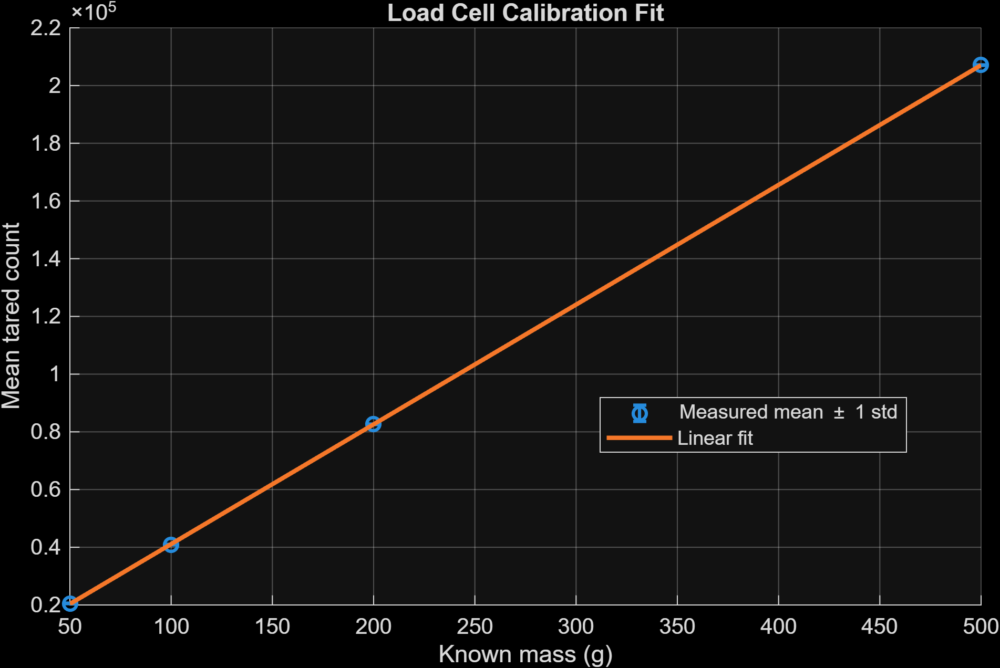
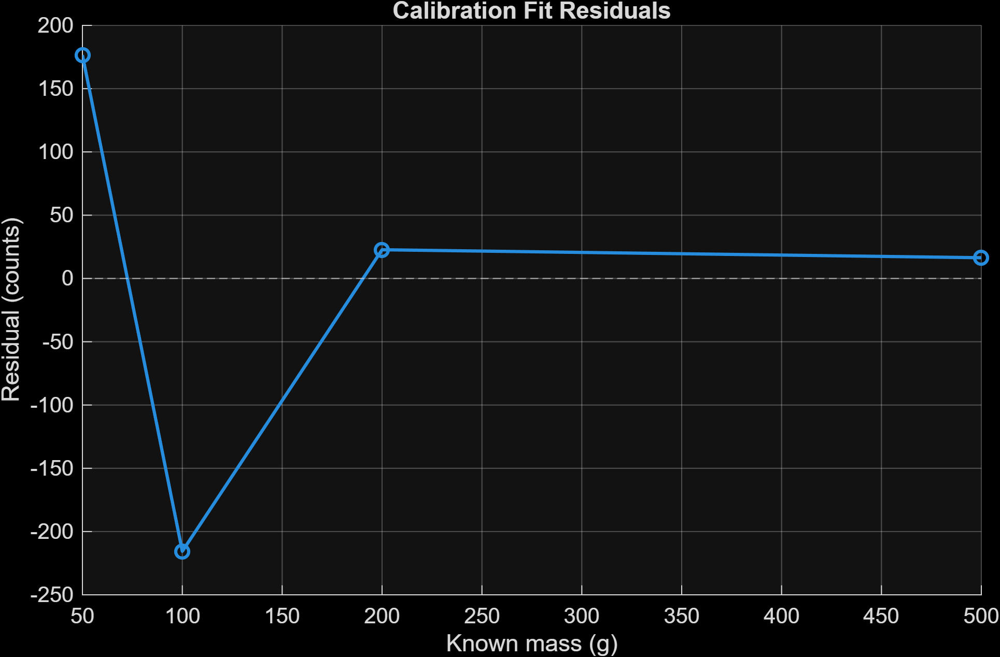
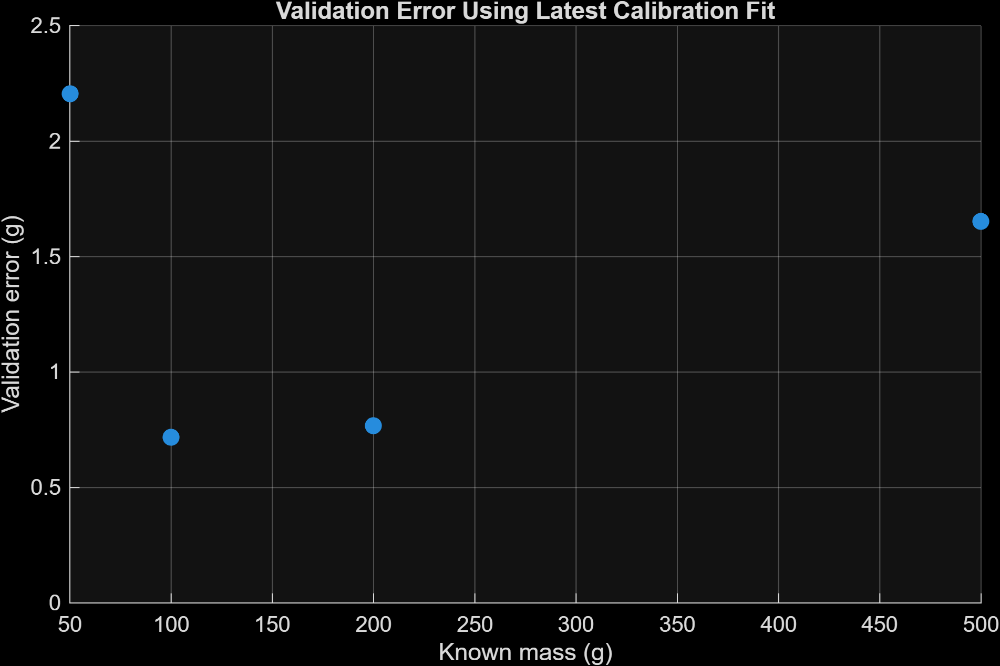
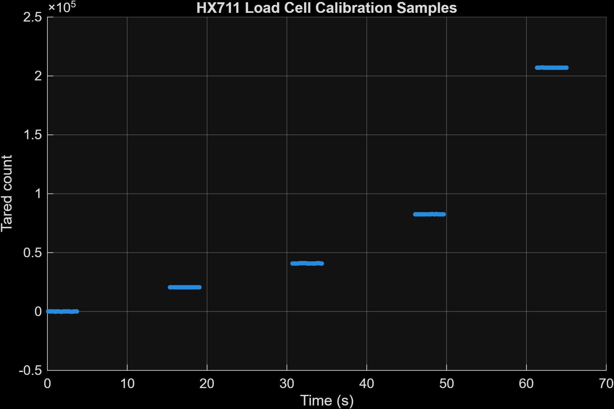

# HX711 Load Cell Validation Report

## Objective

The purpose of this validation effort was to verify that the HX711-based load cell measurement subsystem was sufficiently accurate, repeatable, and automated to support future thrust characterization and system identification experiments for the thrust-vector rail platform.

This validation focused on:

- verifying reliable HX711 communication,
- calibrating the load cell response,
- evaluating repeatability across multiple known masses,
- validating the resulting calibration fit on independent datasets,
- and establishing confidence in the measurement pipeline before proceeding to thrust identification experiments.

---

# Hardware Configuration

## Electronics

- Raspberry Pi Pico (RP2040)
- HX711 load cell amplifier
- Single-axis load cell
- MicroPython firmware
- Automated CSV acquisition and retrieval pipeline using `mpremote`

## HX711 Pin Configuration

|Signal|Pico Pin|
|---|---|
|DAT / DOUT|GP20|
|SCK / CLK|GP21|

## Calibration Masses

The following calibration masses were used:

```
0g 50g 100g 200g 500g
```

---

# Data Acquisition Workflow

The calibration workflow was designed to support automated experiment execution and mirrored data storage.

## Firmware

The calibration firmware:

- automatically performs tare initialization,
- performs countdown-based user prompts,
- acquires repeated HX711 measurements for each known mass,
- logs all measurements to CSV,
- and prints the saved filename for automated retrieval.

## Automated Run-and-Pull Pipeline

The PC-side orchestration pipeline:

1. runs the MicroPython script on the Pico,
2. automatically pulls generated CSV files,
3. mirrors data into the repository structure,
4. and deletes the copied CSV from the Pico filesystem.

This prevents the Pico filesystem from accumulating duplicate experiment files over time.

---

# Diagnostic Validation

A dedicated HX711 DOUT monitor utility was created to debug communication and readiness issues.

Observed behavior:

- `DOUT = 1` corresponds to HX711 data not ready,
- `DOUT = 0` corresponds to HX711 data ready for transport.

This diagnostic utility was used to isolate:

- incorrect wiring,
- HX711 readiness failures,
- and suspected hardware issues during development.

---

# Calibration Analysis

Calibration analysis was performed in MATLAB using:

- grouped averaging,
- linear least-squares fitting,
- and validation against previous datasets.

## Calibration Summary

|Mass (g)|Mean Tared Counts|Standard Deviation (counts)|
|---|---|---|
|50|21274|31.37|
|100|41403|44.94|
|200|82915|31.29|
|500|207760|24.66|

The measurements demonstrated strong repeatability with low intra-mass variance.

---

# Linear Calibration Fit

The following linear calibration model was identified:

```
counts = 415.008037 * mass_g + 148.655610
```

Resulting calibration constants:

```
counts_per_g   = 415.008037grams_per_count = 0.002409592
```

<a id="fig-calibration-fit"></a>



*Figure 1. Linear calibration relationship between known calibration masses and averaged tared HX711 counts.*

[Figure 1](#fig-calibration-fit) shows the identified linear calibration relationship between known calibration mass and averaged tared HX711 counts.

## Fit Error

```
RMSE ≈ 258.75 countsRMSE ≈ 0.62 g
```

The fit residuals remained small relative to the measurement range and were considered acceptable for thrust characterization and control-oriented system identification.

<a id="fig-calibration-resid"></a>



*Figure 2. Residual error relative to the identified linear calibration model.*

[Figure 2](#fig-calibration-resid) shows calibration residuals relative to the identified linear fit.
Residual magnitudes remained relatively small with no major systematic
nonlinear trend observed.

---

# Validation Across Independent Datasets

The most recent calibration dataset was used as the learning/training set, while earlier calibration datasets were used as validation sets.

The resulting fit generalized consistently across prior calibration runs with:

- low absolute mass estimation error,
- stable counts-per-gram scaling,
- and minimal drift between datasets.

This indicates that:

- the sensor response is repeatable,
- the acquisition pipeline is stable,
- and the calibration procedure is sufficiently robust for continued development.

<a id="fig-calibration-valid"></a>



*Figure 4. Validation error obtained when applying the latest calibration fit to earlier independent calibration datasets.*

As shown in [Figure 4](#fig-calibration-valid), the identified calibration fit generalized consistently across earlier calibration datasets with relatively small validation error.

---

### Measurement Stability and Repeatability

The acquired HX711 measurements demonstrated strong short-term stability and repeatability throughout the calibration process. Distinct plateaus were consistently observed at each applied calibration mass with relatively low intra-mass variance.

<a id="fig-calibration-samples"></a>



*Figure 3. Tared HX711 measurements during the calibration sequence. Stable plateaus and relatively low variance were observed at each applied calibration mass.*

As shown in [Figure 3](#fig-calibration-samples), the measurement variance within each calibration interval remained relatively small compared to the separation between calibration levels. This behavior provided additional confidence that the acquisition pipeline was sufficiently stable for thrust characterization and system identification experiments.

---

# Success Criteria

The following success criteria were considered satisfied:

- Reliable HX711 communication established
- Automated data acquisition pipeline operational
- Automated CSV mirroring and organization operational
- Stable and repeatable calibration measurements obtained
- Linear calibration fit validated
- Validation performance acceptable for thrust system identification
- Measurement subsystem capable of supporting future thrust mapping experiments

---

# Limitations

This validation effort was intended for:

- experimental controls development,
- relative thrust characterization,
- and system identification.

Additional future improvements may include:

- longer-duration stability analysis,
- vibration isolation,

---

# Conclusion

The HX711 load cell subsystem demonstrated:

- stable operation,
- repeatable measurements,
- and acceptable calibration accuracy for experimental thrust identification.

The subsystem is therefore considered validated for progression into:

- thrust mapping,
- open-loop thrust characterization,
- and subsequent control-oriented system identification experiments for the thrust-vector rail platform.