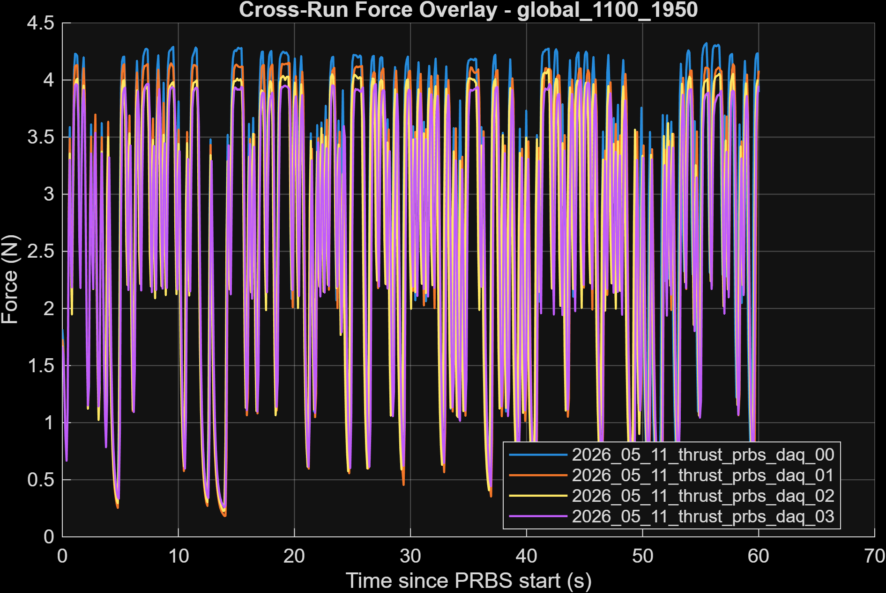
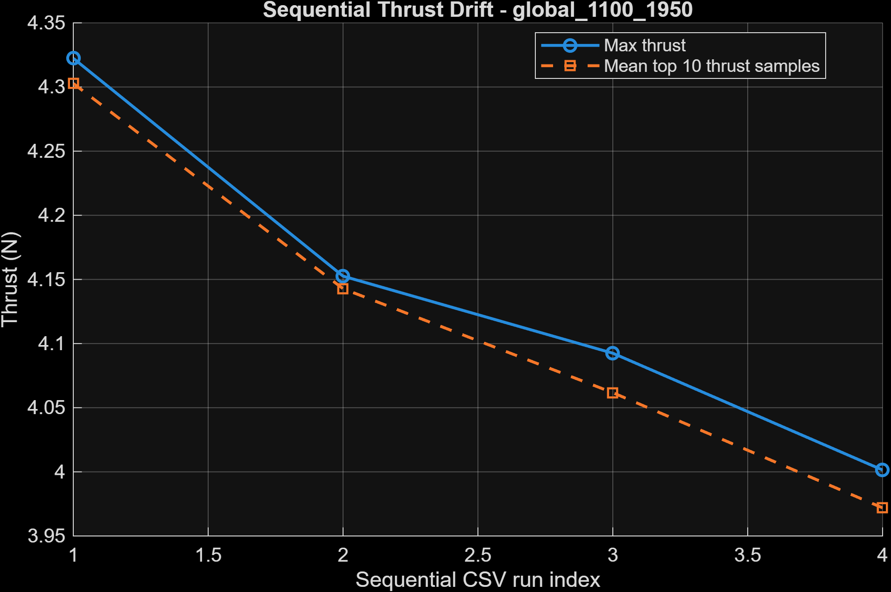

# Thrust Drift and Voltage Considerations

# Observation

Sequential PRBS thrust identification experiments exhibited a noticeable reduction in measured thrust output across repeated runs, even when commanded PWM ranges and operating conditions remained nominally consistent.

This behavior was observed by overlaying repeated PRBS runs of identical excitation profiles and comparing measured thrust responses over time.

*Figure 1. Overlay of repeated PRBS thrust identification runs showing a gradual reduction in measured thrust output across sequential experiments.*

*Figure 2. Max and average max thrust plotted against sequential PRBS thrust identification runs*

As shown in [Figure 1](#fig-thrust-drift) and [Figure 2](#fig-thrust-seq-drift)
, later runs consistently produced lower thrust magnitudes than earlier runs under similar PWM excitation conditions.

---

# Interpretation

The observed behavior suggests that the actuator subsystem may exhibit time-varying dynamics over the duration of operation.

Possible contributing factors include:

- battery voltage sag,
- ESC thermal effects,
- motor heating,
- propeller airflow changes,
- and/or load cell offset drift.

At this stage, the experiments demonstrate correlation rather than direct causal proof. However, the observed thrust reduction is consistent with expected battery voltage decline during sustained motor operation.

---
# Implications for System Identification

This observation is important because it challenges the assumption of strict time invariance within the thrust generation subsystem.

In particular:
> same PWM command $\neq$ same thrust output over time

As a result:
- identified actuator models may vary across battery state,
- operating-point-dependent behavior may become more pronounced,
- and future controllers may require compensation for changing actuator effectiveness.

This effect may partially explain:
- differences between sequential identification runs,
- changing identified gains,
- and degradation in model consistency over extended experiments.

---

# Planned Mitigation

To better characterize this behavior, future experiments will incorporate Pixhawk-based voltage telemetry during thrust identification experiments.

This upgrade will allow:

- direct correlation between thrust output and battery voltage,
- improved characterization of actuator dynamics under voltage sag,
- and development of voltage-aware thrust models.

Potential future model structures may include:

> $F = f(PWM, battery_voltage)$

or dynamic models of the form:

> $F[k+1] = aF[k] + bPWM[k] + cV[K] + d$

where:
- $F$ = thrust
- $PWM$ = commanded ESC input,
- $V$ = measured battery voltage.

---

# Future System Extensions

Integration of the Pixhawk also provides a pathway toward:

- IMU integration,
- sensor fusion,
- encoder + IMU state estimation,
- and higher-fidelity closed-loopo control experiments.

This instrumentation upgrade is expected to improve both:
- system identification fidelity,
- and future autonomous control development for the thrust-vector rail platform.