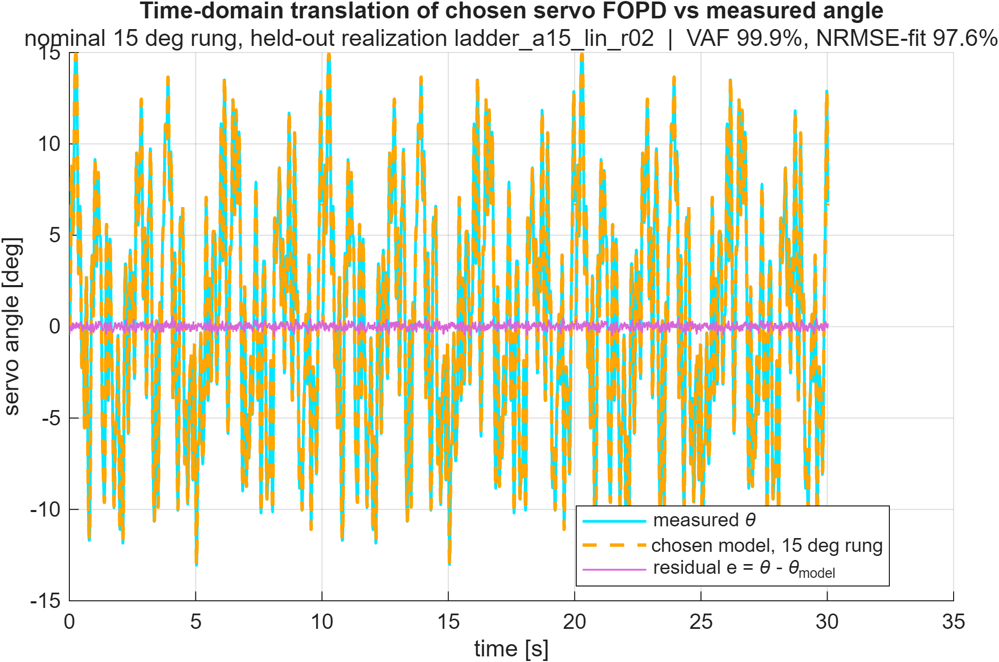

# Servo Actuator Identification Results

## Summary

> **Hardware generations.** The servo was **upgraded 2026-06-29** to a faster digital servo.
> The **canonical accepted model** is the upgraded servo's **amplitude-ladder** PRPS campaign
> (2026-07-02), documented in
> [Accepted Model — Upgraded Servo (Amplitude-Ladder)](#accepted-model--upgraded-servo-amplitude-ladder-2026-07-02)
> immediately below. Everything from
> [Step Response Analysis](#step-response-analysis) onward — including the old two-band
> re-run (K = 0.001479, τ = 29.9 ms, L = 35.4 ms) — describes the **superseded slow servo**
> and is retained as methodology/history. The identification *approach* carries over; the
> numbers do not.

The servo command-to-angle dynamics are identified open-loop by **PRPS frequency-domain
fitting**, bracketed by **step tests** that set the corner frequency, velocity ceiling, and
amplitude limits the PRPS excitation must respect (see [procedure.md](procedure.md)).

The servo **cannot** be treated as an instantaneous map: even the fast upgraded servo's
combined lag + delay ($\tau_\theta + L_\theta \approx 30.5$ ms) contributes $\sim 11^\circ$
phase loss at 1 Hz, so it enters the rail plant as an explicit actuator state. Recommended
initial closed-loop bandwidth $\le 1$ Hz.

---

## Accepted Model — Upgraded Servo (Amplitude-Ladder, 2026-07-02)

The canonical servo dynamic ID is the **amplitude-ladder** PRPS campaign on the upgraded
servo. A ladder of angle-amplitude rungs (±5° … ±15°) is each excited with a crest-minimized
linear PRPS block; a first-order-plus-delay is fit per rung, and slew probes on the large
rungs locate the slew knee. Analysis + report:
[`analyze_servo_prps_amplitude_sweep.m`](../../analysis/system_identification/servo_identification/servo_prps_log/analyze_servo_prps_amplitude_sweep.m).

Unlike the earlier two-band pass — whose τ was fit from data that stopped at 6.1 Hz, *below*
its own corner, so the corner was extrapolated — the ladder linear blocks **measure through
the ~9 Hz corner** (coherence edge 8.7–15 Hz per rung). This resolves the τ/L trade the
two-band could not, which is why the ladder gives τ ≈ 17–20 ms / L ≈ 13.4 ms where the
two-band gave the inflated τ = 27.5 ms / L = 20.6 ms. The ladder therefore **supersedes** the
upgraded-servo two-band attempt as well as the slow-servo model.

### Nominal model (±15° operating rung)

$$
G_\theta(s) = \frac{\theta(s)}{u_{servo}(s)} = \frac{0.001618}{1 + 0.0171\,s}\,e^{-0.0134\,s} \quad [\text{rad}/\mu\text{s}]
$$

### Per-rung results and uncertainty window

| θ (deg) | K (rad/µs) | τ (ms) | L (ms) | corner $f_c$ (Hz) | coherence edge (Hz) |
|---:|---:|---:|---:|---:|---:|
| 5  | 0.001685 | 20.0 | 13.5 | 7.96 | 15.1 |
| 7  | 0.001655 | 19.7 | 13.4 | 8.09 | 15.1 |
| 9  | 0.001637 | 19.6 | 13.3 | 8.12 | 14.4 |
| 11 | 0.001620 | 19.2 | 13.3 | 8.28 | 11.8 |
| 13 | 0.001630 | 19.3 | 13.2 | 8.27 | 10.0 |
| **15** | **0.001618** | **17.1** | **13.4** | **9.32** | **8.7** |

### Uncertainty quantification

Two independent uncertainty tiers are reported, both derived from the same PRPS data by the
analysis script (see [procedure.md](procedure.md) for the bootstrap mechanics):

- **Statistical — per-rung bootstrap.** Each rung's FOPD is bootstrapped by resampling whole
  PRPS periods with replacement, stratified by realization, and refitting ($n = 200$ draws,
  preserving the $K$–$\tau$–$L$ correlation). The 95% CIs come out **very tight** — at ±15°,
  $\tau \in [17.1, 17.1]$ ms, $K_\theta \in [0.0016174, 0.0016185]$ — i.e. the parameters are
  pinned by the data at each amplitude.
- **Systematic — amplitude-dependence.** Across the 5–15° rungs the parameters move **far more
  than** the per-rung CIs, so amplitude-dependence, not statistical scatter, is the dominant
  uncertainty. The **min/max window across rungs is the Stage 2 uncertainty set**, written
  verbatim into the parameter store
  ([`identified_parameters.json`](../../data/processed/identified_parameters/identified_parameters.json)).

| Param | Nominal (±15°) | Bootstrap 95% CI (±15°) | Amplitude window (5–15°) |
|---|---:|---:|---:|
| $K_\theta$ (rad/µs) | 0.001618 | 0.0016174 – 0.0016185 | 0.001618 – 0.001685 |
| $\tau_\theta$ (ms) | 17.1 | 17.1 – 17.1 | 17.1 – 20.0 |
| $L_\theta$ (ms) | 13.4 | 13.4 – 13.4 | 13.2 – 13.5 |

That the amplitude window is roughly an order of magnitude wider than the bootstrap CI is the
whole point: the robust stabilizer must cover the amplitude window, and it can because the
statistical noise *within* each operating point is negligible. $L$ is effectively
amplitude-invariant (13.2–13.5 ms). The lash-free static-map DC gain (−0.093996 deg/µs →
0.0016405 rad/µs) agrees with the dynamic $K_\theta$ within ~1.4% and falls inside the window —
an independent cross-check. The τ/L-vs-amplitude figure carries the bootstrap CIs as error bars,
visually confirming the systematic-over-statistical separation.

### Time-domain validation

The chosen ±15° FOPD is translated to the time domain via `lsim` on a held-out ±15° realization
(`ladder_a15_lin_r02`), each PRPS burst scored on its own grid with the `lsim` startup transient
(first $\sim 3\tau + L$) excluded:

| Metric | Value |
|---|---:|
| VAF | **99.9%** |
| NRMSE-fit | 97.6% |

The model overlays measured angle across the full ~30 s realization and the residual is bounded
near the ±0.39° backlash floor with no systematic structure — the linear FOPD captures the
dynamics and only sub-degree backlash/quantization remains. This is the time-domain confirmation
of the frequency-domain FRF fit (coherence $\ge 0.9$ to 8.7 Hz, sub-dB in-band error), which is
the formal acceptance metric.

### Requirement check

Effective vectoring bandwidth $f_\text{vec}(\theta) = \min(f_c, f_\text{slew})$ clears the M3
disturbance-rejection crossover (1.94 Hz) across all rungs (measured $f_\text{vec}$ 7.5–8.1 Hz).
It does **not** meet the separate 10 Hz purchase-facing target — that is a hardware-selection
margin spec, not the closed-loop crossover, and does not gate the crude stabilizer.

---

## History — Superseded Slow Servo (pre-2026-06-29 upgrade)

> Everything below this line characterizes the **original slow servo** and is retained for
> methodology and provenance. The accepted parameters are in
> [Accepted Model — Upgraded Servo (Amplitude-Ladder)](#accepted-model--upgraded-servo-amplitude-ladder-2026-07-02)
> above. Do not use the numbers below for design.

---

## Step Response Analysis

The step tests characterize what the linear model *cannot* see — the effective
bandwidth, the rate limits, and the static nonlinearities. These define the
operating box the PRPS excitation has to stay inside.

| Quantity | Value | Source / note |
|---|---:|---|
| Step-reconstruction corner | $\approx 3.4$ Hz | effective $-3$ dB bandwidth recovered from step rise; sets where phase/rolloff information lives |
| Peak slew rate | $\sim 240$ deg/s | fastest measured small-step transient |
| Large-reversal rate-limiting | reversal rise $1.26\times$ small-step | rate-limiting onset on direction changes |
| Directional hysteresis / backlash | $\pm 2^\circ$ steady-state offset | step test + static-map hysteresis (2° mean / 4° max), negative-direction undershoot |
| Encoder count integrity | loss-free to $\pm 36^\circ$; up to $5.4^\circ$/cycle lost at $\pm 55^\circ$ fast moves | [encoder mismatch validation](../../analysis/hardware_validation/servo_encoder/servo_pwm_sweep_encoder_mismatch/analyze_servo_pwm_sweep_encoder_mismatch.m) |

The $\pm 2^\circ$ offset is **mechanical**, not a measurement artifact: return-to-center stayed at the
~1-count quantization floor throughout the servo-ID motion regime. It must be carried into
Monte-Carlo / robustness sims as a backlash block (limit-cycle fidelity) and a force-disturbance
overbound (tracking budget).

**What the step results dictate for excitation.** The $\approx 3.4$ Hz corner is the
frequency around which phase and rolloff must be measured — excitation that stops below it
leaves the bandwidth *extrapolated*, not identified. The $\sim 240$ deg/s peak slew and the
$1.26\times$ reversal rate-limiting mean the drive must stay well clear of the rate-limit knee to
keep the response linear; we adopt a conservative **120 deg/s velocity ceiling** (roughly half the
measured peak) as the linearity/safety bound for excitation design. The $\pm 36^\circ$ loss-free
encoder envelope and $\pm 2^\circ$ hysteresis bound the usable command amplitude.

---

## Transition — Step Findings Reshape the PRPS Excitation

The prior PRPS pass (log-spaced 0.10–3.05 Hz, unit-amplitude lines, random phases) stopped
*below* the 3.4 Hz corner, so its $-3$ dB bandwidth (6.5 Hz) was extrapolated rather than
measured. The PRPS acquisition was therefore **re-run** with an excitation designed against
the step limits. Each step finding maps onto one design change:

1. **Line grid spanning ~0.3–15 Hz, weighted around and above the 3.4 Hz corner.** Replaces the
   0.10–3.05 Hz log grid so phase and rolloff *across* the corner are measured, not inferred.
2. **Schroeder phases → crest-factor minimization pass, verified against the 120 deg/s ceiling.**
   Random phasing wasted command headroom; crest-minimized phasing packs more in-band power under
   the same realized peak velocity, and the realized peak is checked against the velocity ceiling
   the step slew rate set.
3. **$A_\text{flat}$-below-$f_c$, $1/f$-above amplitude taper as the per-line envelope.** Since
   sinusoidal velocity is $2\pi f A$, flat amplitude would blow the velocity budget at the top of
   the band; the $1/f$ taper holds per-line velocity bounded while letting the optimizer
   redistribute power within the ceiling, keeping the drive inside the $\pm 36^\circ$ /
   $\pm 2^\circ$ envelope.
4. **Recover top-of-band SNR by averaging more periods/realizations, not by raising amplitude.**
   Amplitude is capped by the velocity ceiling and the encoder loss-free envelope, so high-frequency
   SNR is bought with more periods/seeds instead. Measured coherence ($\gamma^2 \ge 0.9$) then
   defines the *true* upper band edge — replacing the extrapolated 6.5 Hz bandwidth with a measured one.

The re-run is **complete**; the accepted parameters, uncertainty, and trusted band in
[Identified Parameters and Uncertainty](#identified-parameters-and-uncertainty-two-band-re-run--accepted)
below come from it and **supersede the prior pass**. The prior-pass numbers are retained
in this document only as history / methodology context.

The re-run is a combined two-band campaign generated by
[`design_servo_prps_excitation.py --combined`](../../tools/design_servo_prps_excitation.py).
The two bands differ by **drive amplitude**, not frequency range: a large-signal band
($\pm 11^\circ$, clearing the $\pm 2^\circ$ backlash, 0.3–3.4 Hz) and a small-signal band
($\pm 5^\circ$, 0.3–10.75 Hz). Both sweep the shared 0.3–3.4 Hz frequencies — that overlap is
measured at two amplitudes and serves as the amplitude-dependence test — while only the
small-signal band extends across the corner. The fit-low-then-test-high-against-the-CI-tube
logic — merge into one wide-band FOPD if consistent, else route the high band to
high-frequency uncertainty — is implemented in
[`analyze_servo_prps_two_band.m`](../../analysis/system_identification/servo_identification/servo_prps_log/analyze_servo_prps_two_band.m).

**Outcome of the first re-run (2026-06-26): SEPARATE.** The small-signal FRF left the
large-signal fit's 95% CI tube (amplitude-dependence is measurable, consistent with the
$\pm 2^\circ$ backlash being relatively larger at $\pm 5^\circ$), so the bands were *not*
merged. **Corner caveat:** because the small-signal band was therefore not folded into the fit,
the nominal $\tau$ — and its corner $1/(2\pi\tau) \approx 5.3$ Hz — is still fit from
large-signal data that stops at 3.4 Hz, i.e. *below its own corner*. The small-signal band was
meant to measure the rolloff through the corner; since it diverged it became a high-frequency
multiplicative uncertainty $W(f)$ instead. **The nominal corner thus remains a large-signal
extrapolation bracketed by $W(f)$, not a directly measured corner** — the same extrapolation
limitation as the prior pass, now quantified rather than removed.

---

## Identified Parameters and Uncertainty (two-band re-run — accepted)

The accepted model is the **large-signal (operating-amplitude, $\pm 11^\circ$) low-band
FOPD**, fit to the pooled low-band FRF and bootstrapped (n=300). The small-signal high
band is **not** folded in (SEPARATE decision below); its deviation is carried as a
high-frequency multiplicative uncertainty $W(f)$. Analysis + report:
[`analyze_servo_prps_two_band.m`](../../analysis/system_identification/servo_identification/servo_prps_log/analyze_servo_prps_two_band.m)
(12 CSVs: 4 low-band + 8 high-band).

| Param | Nominal | 95% CI (bootstrap, n=300) | Rel. SE |
|---|---:|---:|---:|
| $K$ (rad/µs) | 0.0014787 | 0.0014781 – 0.0014793 | 0.04% |
| $\tau$ (ms) | 29.89 | 29.69 – 30.10 | 0.7% |
| $L$ (ms) | 35.43 | 35.02 – 35.82 | 1.1% |

**Trusted band.** High-band coherence $\gamma^2 \ge 0.90$ is **measured out to 10.775 Hz**,
replacing the prior pass's *extrapolated* 6.5 Hz $-3$ dB bandwidth. **High-frequency
uncertainty** $W(f) = |G_\text{emp}/G_\text{low} - 1|$: overlap max $0.12$, extension max
$0.42$. The $(K,\tau,L)$ bootstrap cloud is the **Stage 2 uncertainty set**; $W(f)$ is the
high-frequency robustness weight for Stage 2.

**Decision: SEPARATE.** The small-signal high band fell entirely outside the large-signal
fit's 95% CI tube (0% inside in both the overlap and extension regions), i.e.
amplitude-dependence is measurable — so the bands were not merged.

**DC gain.** Static-map (lash-free) $\approx 0.00161$ rad/µs vs the accepted operating-amplitude
$K = 0.001479$ ($\sim 8\%$ lower; the prior pass agreed with static to $\sim 2\%$). The gap is
consistent with the measurable amplitude-dependence that forced the SEPARATE outcome — the
static chord averages the full $\pm 100^\circ$ stroke while $K$ is the $\pm 11^\circ$
operating-amplitude regime.

**Prior pass (superseded).** $K = 0.001556$ rad/µs, $\tau = 24.4$ ms, $L = 28.8$ ms over
0.10–3.05 Hz (16 files, 4 amplitudes × 4 seeds; [bootstrap_uncertainty.md](bootstrap_uncertainty.md)).
Retained for history only.

Static map: $K_\theta = -0.091092$ deg/µs, neutral $1430.75$ µs ([`servoStaticMap()`](../../analysis/utils/servoStaticMap.m)).
Encoder scale: $2400$ counts/rev = $0.15^\circ$/count, **spec-derived and exact**
($1:1$ GT2 16T belt, 600 PPR × 4 quadrature; toothed belt, no slip, equal teeth →
exact angular ratio). Single source of truth:
[`encoderAngleScale()`](../../analysis/utils/encoderAngleScale.m). This supersedes
the prior empirical "$\approx 2414$ counts/rev," which was a $\sim 1^\circ$
protractor misread of a sweep that was actually $\approx 181^\circ$, not $180^\circ$;
the half-revolution sweep has been **retired** (no-tooth-skip reliability is covered
by the [encoder reliability investigation](../../docs/system_identification/encoder_reliability_investigation.md)).

---

## Static Command-to-Angle Map (full-range discovery sweep, 2026-06-26)

The static sweep was re-run as a **discovery sweep**: the servo walks outward from
center in both directions and stops each leg when the encoder flatlines (true
saturation), rather than assuming hand-declared endpoints. This replaces the prior
arbitrary $450/2450$ µs endpoints and round $1450$ µs center. Analysis:
[`analyze_servo_static_sweep.m`](../../analysis/system_identification/servo_identification/servo_sweep_log/analyze_servo_static_sweep.m).

**Range and saturation.** Responsive command range $306$–$2681$ µs, spanning
$\approx 215^\circ$ of measured travel; the servo stalls cleanly at both extremes
(stall detection in firmware, saturated samples excluded from all fits). The
**$180^\circ$ mechanical-travel requirement is met with margin** — a window centered
on neutral (e.g. $\sim 430$–$2400$ µs) delivers $180^\circ$ while staying clear of
both stall zones.

**Static gain.** The map is linear across the whole responsive range:

| Quantity | Value | Note |
|---|---:|---|
| Full-range chord gain | $-0.091006$ deg/µs ($-0.00158836$ rad/µs) | matches prior $-0.091092$ |
| Branch-mean (lash-free) gain | $-0.092427$ deg/µs ($-0.00161315$ rad/µs) | up/down branch average |
| Up-branch gain | $-0.093646$ deg/µs | $1456$–$2681$ µs |
| Down-branch gain | $-0.091207$ deg/µs | $306$–$1406$ µs |
| Branch slope agreement | $2.6\%$ | the two branches are the same line |
| Chord neutral | $1415.2$ µs | zero-angle command, chord fit |
| Branch-mean (lash-free) neutral | $1423.7$ µs | zero-angle command, pairs with the lash-free gain |
| Within-branch gain ripple | $7.0\%$ (up) / $7.9\%$ (down) | residual nonlinearity per branch |

**Backlash appears as a step at center — not a deadzone.** The up and down legs are
the two backlash branches (the center-out walk preloads gear lash in each leg's
direction, so gears stay engaged the whole sweep). Fitting them separately gives
two parallel lines offset by a **$2.40^\circ$ vertical gap at center** — the gear
**lost motion (backlash)**. This independently confirms the $\pm 2^\circ$ / $4^\circ$-max
backlash from the [step and hysteresis tests](#step-response-analysis) and enters the
truth model as a backlash block, **carried separately from the linear gain** (it is a
step at center, not extra gain — the opposite of a deadzone, which would be a *flat*
region from sweeping continuously through center and reversing there).

**Artifact retired.** The previously reported "center-region gain" ($\approx -0.086$
deg/µs over $\pm 300$ µs) was an artifact of fitting a window that *straddled* the
$2.40^\circ$ center step, mixing both branches and flattening the apparent slope. It
is no longer computed or reported; the lash-free gain is the branch-mean
$-0.092427$ deg/µs with backlash carried as the separate $2.40^\circ$ block.

**Recommended `servoStaticMap()` update (pending review).** The shipped
[`servoStaticMap()`](../../analysis/utils/servoStaticMap.m) currently holds
$-0.091092$ deg/µs, neutral $1430.75$ µs (consistent with the *chord*). The
finalized lash-free values are $K_\theta = -0.092427$ deg/µs ($1.5\%$ steeper),
neutral $u_0 = 1423.7$ µs, with backlash $2.40^\circ$ as a separate truth-model
block. Applying this ripples into the PRPS center/amplitude choices and the
friction/step/encoder-mismatch scripts that consume the map; it is held for review
rather than changed silently.

---

## Stage 1 Acceptance Metrics

Targets from [project_metrics.md §1](../../docs/project_metrics.md#1-open-loop-actuator-identification-servo-thrust-friction).
Rows **#5/#6/#8** are refreshed from the two-band re-run (measured band, tightened CIs,
amplitude-dependence/$W(f)$); rows **#1–#4 and #7** are the prior-pass held-out validation
that accepted the FOPD *structure* (the two-band campaign uses a different excitation design,
and its acceptance evidence is the CI-tube test → SEPARATE + $W(f)$, not a held-out VAF).

| # | Metric | Target | Result | Status |
|---|---|---|---|---|
| 1 | Validation fit (held-out) | strong on held-out data | worst held-out FRF error **0.5 dB / 2.6°**; time-domain `lsim` tracks with no drift | **Met** (freq-domain; VAF-% not computed) |
| 2 | Train–validation gap | small | train 0.29 dB vs val ≤0.5 dB | **Met** |
| 3 | Residual autocorrelation | white in band | frequency-domain residual at the FRF-error/noise floor (0.5 dB / 2.6°, $\gamma^2\approx1$) | **Met** (freq-domain) |
| 4 | Residual–input cross-corr. | decorrelated in band | input explains no residual at the excited lines | **Met** (freq-domain) |
| 5 | FRF coherence $\gamma^2$ | $\ge 0.9$ in band | **measured to 10.775 Hz** (two-band high band); prior pass 0.992/1.000 over 0.15–3.05 Hz | **Met** |
| 6 | Parameter CIs | rel. SE $\le 10$–20% | **0.04 / 0.7 / 1.1%** ($K/\tau/L$, two-band n=300) | **Met** |
| 7 | Cross-seed spread | within CIs | per-seed within CI; gain spread $\pm 3.5\%$ across amplitude (prior pass) | **Met** |
| 8 | Amplitude dependence | bound + document | measurable → **SEPARATE**; $W(f)$ overlap 0.12 / extension 0.42; large-signal $K$ ~8% below static chord | **Met (bounded)** |

**Note (#3–#4 artifact).** PRPS is a line spectrum, so the residual is deterministic and periodic —
leftover FRF mismatch and nonlinear distortion sit at the excited lines and their harmonics. The
autocorrelation of such a residual does not decay, and the residual is input-correlated at the lines
by construction, so a raw *time-domain* whiteness test against the $\pm 1.96/\sqrt{N}$ band
($N\sim10^5 \Rightarrow \pm0.004$) rejects it wholesale. That structure reflects the documented
amplitude-dependence and ±2° hysteresis, **not** model-order inadequacy — which is why #3–#4 are
recorded against the frequency-domain residual (the multisine-appropriate form). The raw time-domain
ACF/CCF is retained only as a diagnostic.

---

## Known Limitations

- **Corner still extrapolated, now bracketed (not removed).** The two-band re-run **measured** coherence out to 10.775 Hz (replacing the prior pass's extrapolated 6.5 Hz), but because the decision was **SEPARATE**, the small-signal band was not folded into the fit — so the nominal $\tau$ corner ($\approx 5.3$ Hz) remains a large-signal extrapolation, now *bracketed* by the high-frequency uncertainty $W(f)$ (overlap 0.12, extension 0.42) rather than uncharacterized. This does **not** affect Stage 2 (crossover $\le 1$ Hz sits deep inside the validated band); $W(f)$ is the robustness weight carried into aggressive Stage 4 control above ~2 Hz.
- Residual whiteness (#3–#4) is assessed in the **frequency domain**; the raw time-domain ACF/CCF
  is a diagnostic only (`COMPUTE_RESIDUAL_WHITENESS` in
  [analyze_servo_prps_frequency_fit.m](../../analysis/system_identification/servo_identification/servo_prps_log/analyze_servo_prps_frequency_fit.m)) —
  see the #3–#4 artifact note under Stage 1 Acceptance Metrics.

---

## Stage 1 → Stage 2 Exit

**Justified.** Stage 2 (crude robust stabilizer) consumes two deliverables, both in hand:

1. **The uncertainty set** — the two-band bootstrap $(K,\tau,L)$ cloud (rel. SE ≤ 1.1%) plus the high-frequency multiplicative uncertainty $W(f)$.
2. **The trusted band** — coherence $\ge 0.9$ **measured** to 10.775 Hz, which fully contains the $\le 1$ Hz stabilizer crossover.

All Stage 1 metrics are met (rows #5/#6/#8 from the two-band re-run; #1–#4/#7 from the prior-pass
held-out validation that accepted the FOPD structure). Stage 2 designs a **robust** stabilizer
whose worst-case margins over the CI set **and $W(f)$** absorb the residual nonlinearity and the
amplitude-dependence, and the ±2° hysteresis and encoder loss-free envelope (±36°) are passed
forward as the Stage 2 truth-model nonlinearity and operating limit. The two-band re-run measured
the band above the corner and quantified amplitude-dependence; it does not gate Stage 2, whose
crossover sits deep inside the validated band. Proceeding to Stage 2.
