# Servo Actuator Identification Results

## Summary

The servo actuator was identified using encoder-based angle measurements and open-loop command excitation. The goal was to determine the servo's **usable dynamic range** before final rail-controller design, then select a low-order actuator model suitable for controller development.

Final conclusion:

> The servo **cannot** be approximated as an instantaneous command-to-angle map for the rail controller. The accumulated phase lag (τ ≈ 24 ms, L ≈ 29 ms) is significant relative to any practical rail-controller bandwidth. The selected model is **first-order plus delay**, identified via PRPS frequency-domain fitting. For initial rail-controller design, a conservative closed-loop bandwidth target of ≤ 1 Hz is recommended.

---

## 1. Test Setup

### Hardware

- Servo:
- Encoder:
- Controller: Raspberry Pi Pico
- Transmission: GT2 belt + pulley
- Measurement:
- Data logging rate:

### Relevant Files

| Item | Path |
|---|---|
| Raw data | [`data/raw/system_identification/servo_identification/servo_half_revolution_sweep_log/accepted/`](../../data/raw/system_identification/servo_identification/servo_half_revolution_sweep_log/accepted) |
| Analysis script | [`analysis/system_identification/servo_identification/servo_half_revolution_sweep_log`](../../analysis/system_identification/servo_identification/servo_half_revolution_sweep_log) |
| Plots | [`plots/system_identification/servo_identification/servo_half_revolution_sweep_log`](../../plots/system_identification/servo_identification/servo_half_revolution_sweep_log) |
| Procedure | [`experiments/servo_identification/procedure.md`](procedure.md) |

---

## 2. Encoder Count-to-Angle Calibration

This section uses the half-revolution sweep data to validate the encoder count-to-angle conversion.

### Goal

Convert encoder counts into measured servo angle:

$$
N_{enc} \rightarrow \theta
$$

### Result

| Quantity | Value | Notes |
|---|---:|---|
| Counts per degree | 6.667 counts/deg | Based on accepted nominal conversion of 2400 counts/rev |
| Degrees per count | 0.150 deg/count | $\theta_{deg} = \frac{N_{enc}}{2400} \cdot 360$ |
| Usable measured range | 1207 counts / 181.05 deg | Measured over 450–2450 μs half-revolution sweep |
| Repeatability error | 0 counts endpoint std; 1 count return-to-zero error | Two repeated runs gave identical 1207-count endpoint result; return error ≈ 0.150 deg |

### Conclusion

The encoder calibration was acceptable over the tested half-revolution range. The measured half-revolution displacement was 1207 counts compared to the expected 1200 counts, corresponding to a 0.58% endpoint error and an estimated 2414 counts/rev. The command-versus-count plot showed clean overlap between the upward and downward sweeps, indicating strong repeatability and little visible backlash or slip. The counts-per-revolution estimate converged toward 2400 counts/rev over the sweep, supporting the use of the nominal 2400 counts/rev conversion for servo angle measurement.

### Plots

**Command vs Absolute Encoder Count Delta.**  

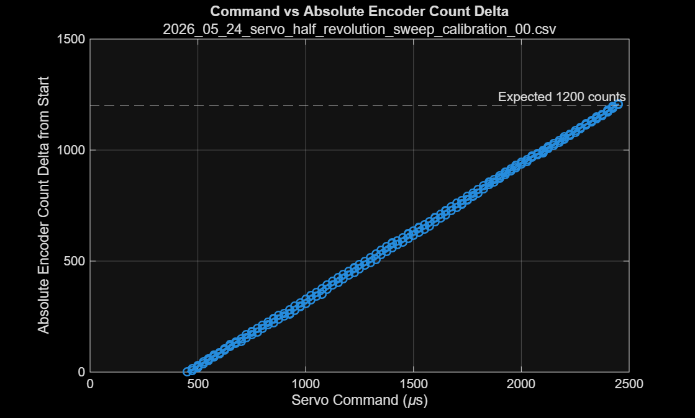

This plot shows a clean and nearly linear increase in absolute encoder count displacement as servo command increases from 450 μs to 2450 μs. The upward and downward sweep traces overlap closely, indicating good repeatability and little visible backlash, slip, or hysteresis over the tested half-revolution range. The final displacement approaches the expected 1200-count half-revolution value.

**Estimated Encoder Counts per Revolution.**  

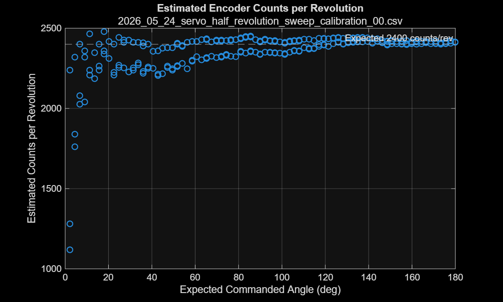

This plot shows the counts-per-revolution estimate as a function of expected commanded angle. At very small angular displacements, the estimate is noisier because small count changes amplify estimation error. As the commanded angle increases, the estimate converges toward approximately 2400 counts/rev and remains close to that value over most of the sweep. This supports the use of 2400 counts/rev as the encoder conversion for servo angle measurement.

---

## 3. Static Command-to-Angle Map

This section uses the static servo sweep data to identify the PWM-to-angle map over the control-relevant servo range. The angle conversion from [Section 2 — Encoder Count-to-Angle Calibration](#2-encoder-count-to-angle-calibration) is used to convert encoder counts into servo angle.

### Goal

Identify the steady-state mapping:

$$
u_{servo} \rightarrow \theta_{ss}
$$

where $u_{servo}$ is the commanded servo PWM value and $\theta_{ss}$ is the measured steady-state servo angle.

This test is not intended to identify the physical saturation limits of the servo. Instead, it characterizes the PWM-to-angle relationship over the system-relevant range for thrust-vectoring control.

### Result

| Quantity | Value | Notes |
|---|---:|---|
| Neutral PWM | 1430.75 μs | PWM command where the fitted static map crosses zero angle |
| Control-relevant tested range | 450–2450 μs | Covers approximately ±90 deg of vectoring motion |
| Static gain (deg) | -0.091092 deg/μs | Combined linear fit over both static sweep files |
| Static gain (rad) | -0.00158986 rad/μs | Same gain converted to radians |
| Local center gain (deg) | -0.091137 deg/μs | From sweep 01 around 1450 ± 300 μs |
| Local center gain (rad) | -0.00159063 rad/μs | Local center-region gain in radians |
| Deadband | Not clearly observed | Static map is nearly linear through the control-relevant range |
| Hysteresis | Mean: ~2.08 deg; Max: ~4.05 deg | Up-sweep/down-sweep difference from sweep 01 |

The combined static command-to-angle fit is:

$$
\theta_{deg} = -0.091092u_{servo} + 130.329728
$$

where:

- $\theta_{deg}$ is the measured servo angle in degrees.
- $u_{servo}$ is the servo command in microseconds.

Equivalently:

$$
\theta_{rad} \approx -0.00158986u_{servo} + 2.27468
$$

where $\theta_{rad}$ is the measured servo angle in radians.

### Plots

**Static Command-to-Angle Map**

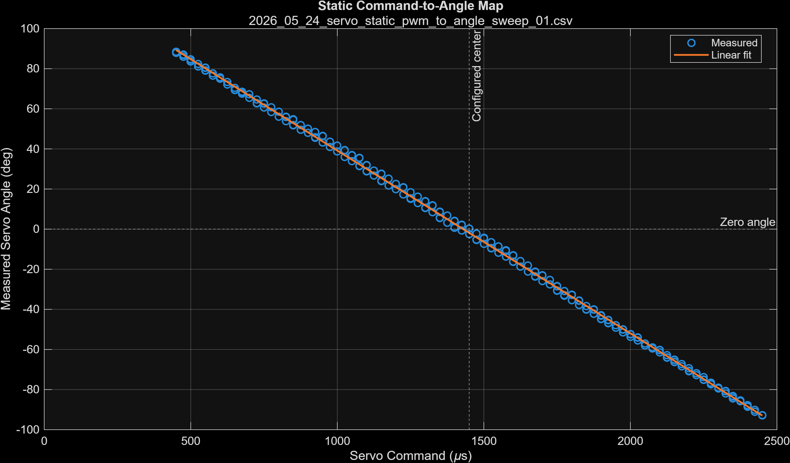

**Up-Sweep vs Down-Sweep Direction Comparison**

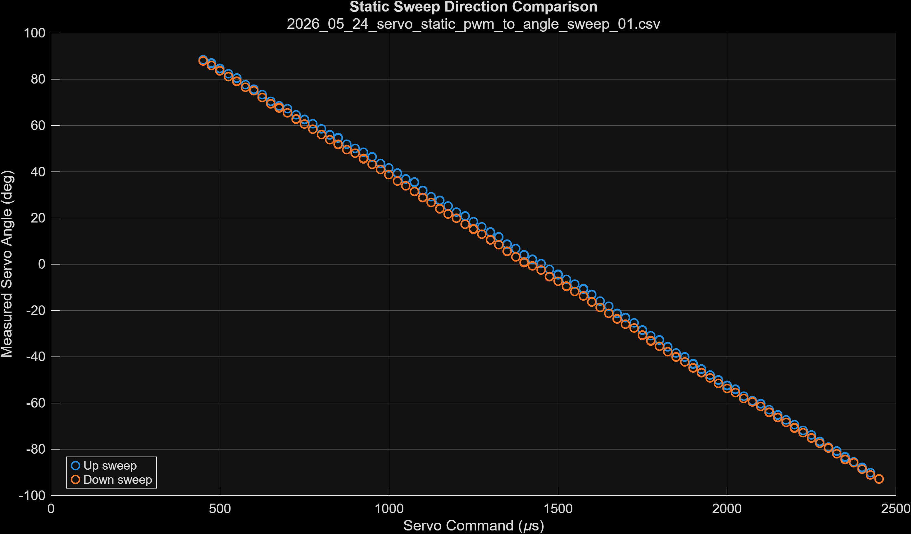

**Hysteresis Estimate**

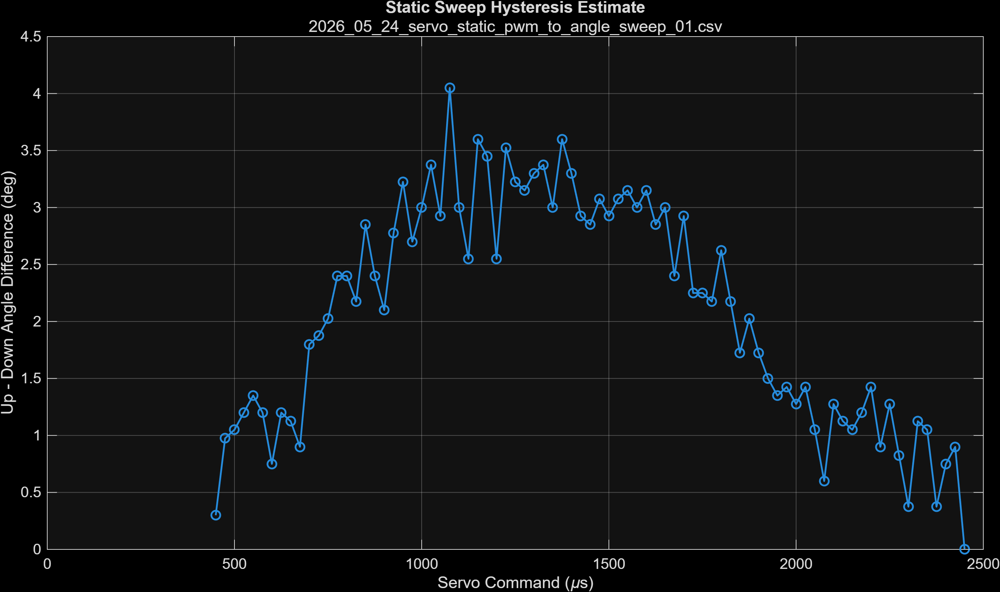

### Conclusion

The static sweep shows a nearly linear inverse relationship between PWM command and measured servo angle over the control-relevant tested range of **450–2450 μs**, corresponding to approximately **+88 deg to -93 deg** of servo motion. Since the thrust-vectoring mechanism should not require motion beyond approximately **±90 deg**, this range is sufficient for control-relevant identification.

No saturation is observed within the tested system-relevant range. The static map remains approximately linear across the usable vectoring envelope, with a combined gain of approximately **-0.0911 deg/μs** or **-0.00159 rad/μs**. The fitted neutral command is approximately **1431 μs**.

The up-sweep and down-sweep traces show modest hysteresis, with approximately **2 deg mean difference** and up to **4 deg maximum difference**. Therefore, small angle differences below this scale should not be overinterpreted as meaningful actuator behavior during later dynamic tests.

---

## 4. Step-Response Results

### Goal

Estimate dominant actuator lag, delay, rise time, settling time, and rate-limit behavior.

### Result

| Test | Step Size | Direction | Delay | Rise Time | Settling Time | Overshoot | Notes |
|---|---:|---|---:|---:|---:|---:|---|
| Center to +10 deg | +10.02 deg | + | 0.0033 s | 0.103 s | 0.185 s | 0% | Small-signal positive center-out response |
| Center to -10 deg | -10.02 deg | - | 0.0050 s | 0.102 s | 0.177 s | 0% | Small-signal negative center-out response; slightly lower measured gain |
| Center to +20 deg | +20.04 deg | + | 0.0064 s | 0.106 s | 0.270 s | 0% | Moderate positive step; longer 2% settling time |
| Center to -20 deg | -20.04 deg | - | 0.0077 s | 0.111 s | 0.200 s | 0% | Moderate negative step |
| +20 deg to -20 deg | -40.08 deg | - reversal | 0.0100 s | 0.137 s | 0.230 s | 0% | Cross-center reversal; slower than center-out steps |
| -20 deg to +20 deg | +40.08 deg | + reversal | 0.0114 s | 0.137 s | 0.281 s | 0.07% | Cross-center reversal; slowest settling behavior |

The grouped averages show that the center-out responses have approximately **0.10–0.11 s** 10–90% rise times, while the full cross-center reversal steps have approximately **0.137 s** 10–90% rise times. The measured overshoot is essentially zero across all tests. The measured step magnitudes are slightly smaller than the static-map command magnitudes, especially for the negative 10 deg steps.

### Estimated Parameters

| Parameter | Value | Notes |
|---|---:|---|
| Dominant time constant, $\tau$ | ~0.047–0.062 s | Estimated from $t_r \approx 2.2\tau$, using 10–90% rise time |
| Effective delay, $L$ | ~0.005–0.011 s | Delay estimate is below the 20 ms sample interval, so treat as approximate |
| Approx. bandwidth | ~2.6–3.4 Hz | Estimated from $f_c \approx 1/(2\pi\tau)$ |
| Rate limit observed? | Mild / possible | Reversal steps are slower than center-out steps, suggesting amplitude or rate-limit effects |
| Overshoot observed? | No | Overshoot is approximately 0% across nearly all tests |

Where:

$$
t_r \approx 2.2\tau
$$

and:

$$
f_c \approx \frac{1}{2\pi\tau}
$$

where $t_r$ is the 10–90% rise time, $\tau$ is the dominant first-order time constant, and $f_c$ is the approximate bandwidth in hertz.

Using the center-out rise times of approximately **0.102–0.111 s** gives:

$$
\tau \approx \frac{0.102 \text{ to } 0.111}{2.2}
$$

$$
\tau \approx 0.046 \text{ to } 0.050 \text{ s}
$$

Using the cross-center reversal rise time of approximately **0.137 s** gives:

$$
\tau \approx \frac{0.137}{2.2} \approx 0.062 \text{ s}
$$

So a reasonable control-relevant estimate is:

$$
\tau \approx 0.05 \text{ s}
$$

with slower large-reversal behavior closer to:

$$
\tau \approx 0.06 \text{ s}
$$

### Plots

- [step\_response\_command\_vs\_time.png](../../plots/system_identification/servo_identification/servo_step_response_test/step_response_command_vs_time.png)
- [step\_response\_measured\_vs\_command\_angle.png](../../plots/system_identification/servo_identification/servo_step_response_test/step_response_measured_vs_command_angle.png)
- [step\_response\_case\_overlays.png](../../plots/system_identification/servo_identification/servo_step_response_test/step_response_case_overlays.png)
- [step\_response\_normalized\_overlays.png](../../plots/system_identification/servo_identification/servo_step_response_test/step_response_normalized_overlays.png)

### Conclusion

Step-response testing suggests the servo behaves approximately like a **first-order actuator with small effective delay** over the tested control-relevant range. The dominant time constant is approximately **0.05 s** for center-out steps and closer to **0.06 s** for full cross-center reversal steps. The approximate bandwidth is therefore on the order of **3 Hz**.

No meaningful overshoot is observed. However, the full **+20 deg to -20 deg** and **-20 deg to +20 deg** reversal steps are slower than the center-out steps, which suggests mild amplitude dependence, direction-reversal effects, or rate limiting. For control design, a conservative actuator model should use a first-order lag with:

$$
\tau \approx 0.06 \text{ s}
$$

and an effective delay of approximately:

$$
L \approx 0.01 \text{ s}
$$

This is conservative enough to capture the slower reversal behavior without overfitting small differences in the measured step responses.

---

## 5. PRBS Decision and Transition to Targeted PRPS Testing

### Goal

Evaluate whether broadband PRBS excitation is the appropriate next step for dynamic servo identification, or whether targeted frequency excitation should be used based on the step-response results from [Section 4 — Step-Response Results](#4-step-response-results).

### Result

| Quantity | Value | Notes |
|---|---:|---|
| Step-response bandwidth estimate | ~3 Hz | Based on dominant actuator time constant from [Section 4 — Step-Response Results](#4-step-response-results) |
| Conservative time constant, $\tau$ | ~0.06 s | Captures slower cross-center reversal behavior |
| Effective delay, $L$ | ~0.01 s | Small but relevant for higher-frequency phase lag |
| PRBS use case | Exploratory only | Useful for quick input-output excitation, but frequency content is not directly controlled |
| Preferred next test | PRPS / targeted multi-sine | Better for controlled excitation over the usable dynamics range |
| Control-relevant fitting range | 0.15–3.05 Hz | Confirmed in [Section 6 — Targeted PRPS / Multi-Sine Results](#6-targeted-prps--multi-sine-results); captures usable actuator dynamics without overfitting high-frequency behavior |
| High-frequency fitting priority | Low | Frequencies beyond the actuator’s useful bandwidth are not control-relevant for this system |

### Rationale

The step-response results from [Section 4 — Step-Response Results](#4-step-response-results) indicate that the servo behaves approximately like a first-order actuator with a dominant time constant of roughly **0.05–0.06 s** and a small effective delay of approximately **0.01 s**. This corresponds to an approximate bandwidth on the order of **3 Hz**.

Because the actuator has limited useful bandwidth, the next dynamic identification test should **focus on the frequency range that is relevant for control**. A broadband PRBS input can excite a wide range of frequencies, but it does not directly control the exact frequency content or emphasize the frequencies most important for actuator modeling. As a result, PRBS may encourage fitting behavior in frequency regions where the actuator has already lost authority or where delay dominates the response.

For this project, the more useful next step is targeted PRPS or multi-sine excitation. This allows the input signal to deliberately excite frequencies inside the control-relevant range while avoiding overemphasis on high-frequency behavior that the controller should not rely on.

### Conclusion

Based on the step-response bandwidth estimate from [Section 4 — Step-Response Results](#4-step-response-results), final servo dynamic identification proceeded with **targeted PRPS / multi-sine excitation** over 0.15–3.05 Hz. This deliberately targets the frequency range where the actuator has meaningful command authority — rather than fitting the widest possible band — producing a model directly useful for controller design. Results are in [Section 6 — Targeted PRPS / Multi-Sine Results](#6-targeted-prps--multi-sine-results).

---

## 6. Targeted PRPS / Multi-Sine Results

### Goal

Identify the servo actuator's **usable dynamic range** using controlled PRPS (Pseudo-Random Periodic Signal) excitation over the frequency band 0.10–3.0 Hz. Four excitation amplitudes were tested (±250, ±500, ±750, ±1000 µs half-peak command variation) to probe amplitude-dependent dynamics. Sixteen training files (4 amplitudes × 4 PRPS seeds) and four validation files (1 held-out seed per amplitude) were analyzed using [`analyze_servo_prps_frequency_fit.m`](../../analysis/system_identification/servo_identification/servo_prps_log/analyze_servo_prps_frequency_fit.m).

### Excitation and Signal Quality

| Quantity | Value |
|---|---:|
| Frequency range | 0.15–3.05 Hz |
| Frequency points per run | 21 |
| Training seeds per amplitude | 4 (seeds 4001–4004) |
| Validation seeds per amplitude | 1 (seed 4005) |
| Training median coherence | ≥ 0.992 across all amplitudes |
| Validation median coherence | 1.000 across all amplitudes |

Coherence was near-unity throughout the full test band — no frequency regions showed signal quality degradation in the 0.15–3.05 Hz range.

### Per-Amplitude FRF and Model Results

The FRF was estimated via FFT-based spectral analysis (`estimatePrpsFrfFromTable()`) and fitted to four candidate model types. The best model at every amplitude was `first_order_delay`:

$$
G(s) = \frac{K}{1 + \tau s} e^{-Ls}
$$

| Amplitude | K (rad/µs) | τ (ms) | L (ms) | Model BW (Hz) | Train mag RMSE | Train phase RMSE | Val mag RMSE | Val phase RMSE |
|---:|---:|---:|---:|---:|---:|---:|---:|---:|
| 250 µs  | 0.001493 | 22.6 | 26.8 |  7.1 | 0.095 dB | 0.73° | 0.235 dB | 1.16° |
| 500 µs  | 0.001561 | 14.9 | 33.0 | 10.7 | 0.075 dB | 0.60° | 0.140 dB | 0.77° |
| 750 µs  | 0.001586 | 20.8 | 31.9 |  7.6 | 0.149 dB | 0.78° | 0.170 dB | 1.55° |
| 1000 µs | 0.001595 | 33.9 | 29.1 |  4.7 | 0.249 dB | 1.66° | 0.372 dB | 3.27° |

The static gain K is consistent across amplitudes (0.00149–0.00160 rad/µs, within ±3.5% of the mean), in close agreement with the Section 3 static-map gain of **0.00159 rad/µs**. The time constant τ increases with amplitude — 15 ms at ±500 µs rising to 34 ms at ±1000 µs — indicating mild amplitude-dependent dynamics consistent with rate limiting or nonlinear friction effects at larger excursions.

### Global Pooled Model

Pooling all 16 training files across amplitudes yields a single amplitude-agnostic model:

$$
G_{global}(s) = \frac{0.001556}{1 + 0.0244 s} e^{-0.0288 s}
$$

| Quantity | Value |
|---|---:|
| K | 0.001556 rad/µs |
| τ | 24.4 ms |
| L | 28.8 ms |
| Model bandwidth | 6.5 Hz |
| Train weighted error | 0.058 |
| Train magnitude RMSE | 0.294 dB |
| Train phase RMSE | 2.71° |

Global model validation scores against held-out seed-4005 files:

| Amplitude | Mag RMSE | Phase RMSE |
|---:|---:|---:|
| 250 µs  | 0.502 dB | 1.99° |
| 500 µs  | 0.188 dB | 2.64° |
| 750 µs  | 0.322 dB | 1.65° |
| 1000 µs | 0.381 dB | 2.41° |

### Amplitude Generalization

Cross-amplitude generalization errors are 3–4× larger than within-amplitude fit errors (e.g., phase errors of ~6° vs ~1° within-amplitude), confirming mild but real amplitude-dependent nonlinearity. The global model reduces this by pooling across amplitudes at the cost of slightly higher individual fit errors.

### Usable Dynamic Range Markers

| Marker | Value | Notes |
|---|---:|---|
| -3 dB magnitude drop | > 3.05 Hz | Not observed in test band; model-predicted 4.7–10.7 Hz (amplitude-dependent) |
| ~45° phase lag | ~2 Hz | Based on global model (τ = 24.4 ms, L = 28.8 ms) |
| Coherence degradation | None in band | Coherence ≥ 0.99 throughout 0.15–3.05 Hz |
| Amplitude-dependent lag | Present | τ increases from 15 ms (±500 µs) to 34 ms (±1000 µs) |
| Practical usable bandwidth | ~2–3 Hz | Conservative estimate below 45° phase-lag frequency |

The servo retains full command authority (no -3 dB attenuation) across the entire 0.15–3 Hz test band. The limiting factor at the top of the control-relevant range is **phase lag**, not magnitude attenuation: the global model predicts approximately 56° of total phase lag at 3 Hz.

### Plots

**Bode Magnitude — Global Fit (all amplitudes)**

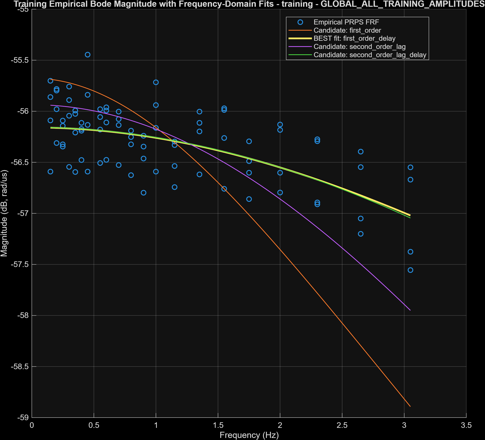

Empirical FRF magnitude points from all four amplitude conditions with the global first-order-delay model overlaid. The servo magnitude remains flat (within ~0.3 dB) across the full 0.15–3.05 Hz band. The -3 dB rolloff is not reached within the test band.

**Bode Phase — Global Fit (all amplitudes)**

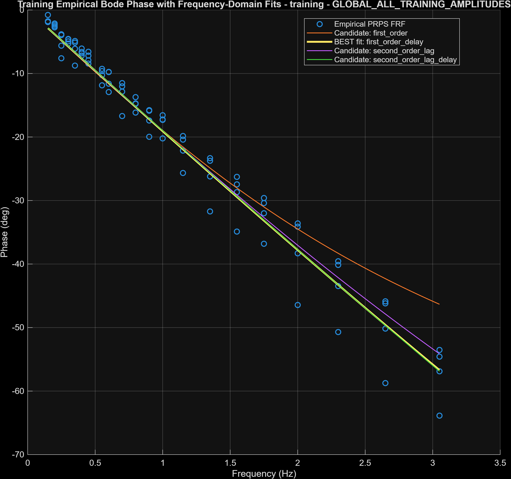

Phase lag increases monotonically across the band, reaching approximately 40–60° at 3 Hz. The global model captures the trend well, with residual per-amplitude spread reflecting the amplitude-dependent time constant.

**Amplitude-Normalized Bode (Magnitude and Phase)**

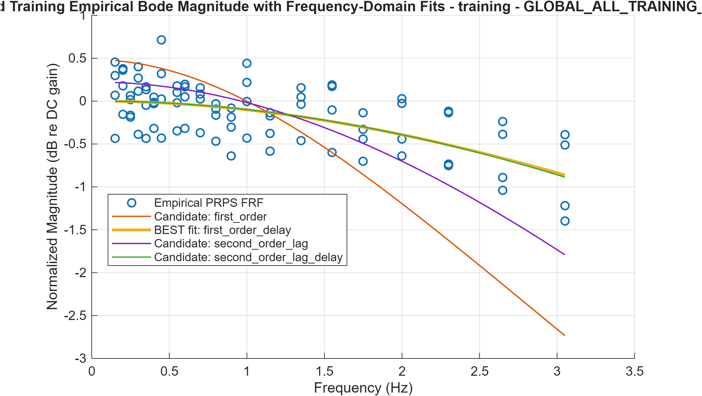

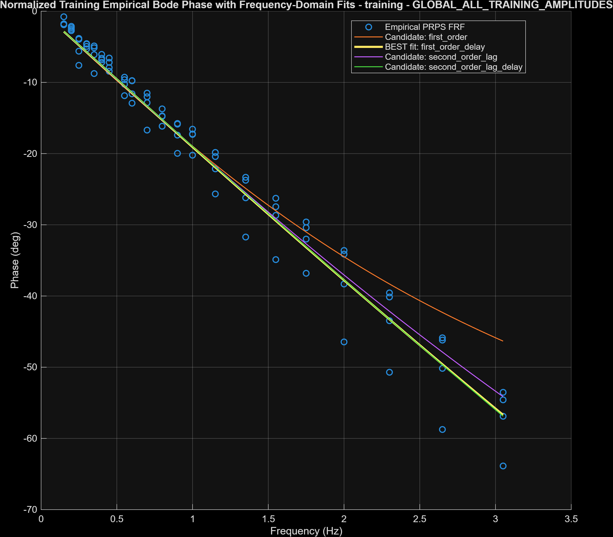

After normalizing each run's FRF to its own low-frequency gain, the magnitude curves collapse tightly but the phase curves show systematic spread — the larger-amplitude runs accumulate more lag at high frequency. This is the clearest evidence of amplitude-dependent dynamics.

**Amplitude Generalization Curve**

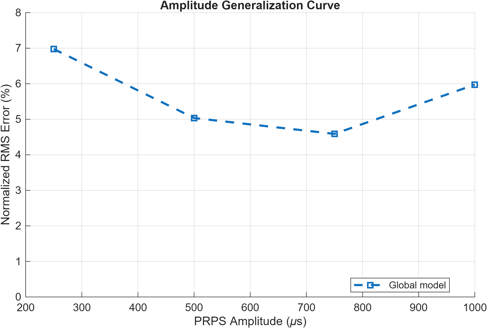

Normalized RMS cross-amplitude generalization error vs PRPS excitation amplitude for local and global models. Local models show the expected V-shape (lowest error at their own amplitude); the global model has uniformly moderate error across all amplitudes.

**Model Candidate Comparison (amp1000 example)**

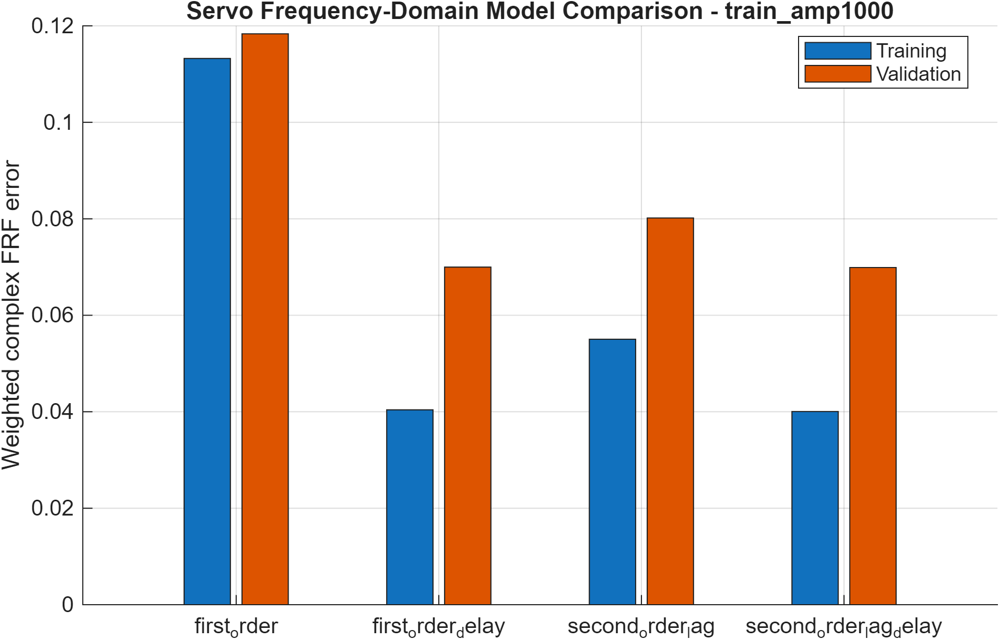

Training vs validation weighted error for all four candidate model types at amp1000. `first_order_delay` achieves the best balance: significantly lower error than `first_order` alone, with no improvement from the additional complexity of `second_order_lag_delay`.

**Time-Domain Validation (Global Model)**

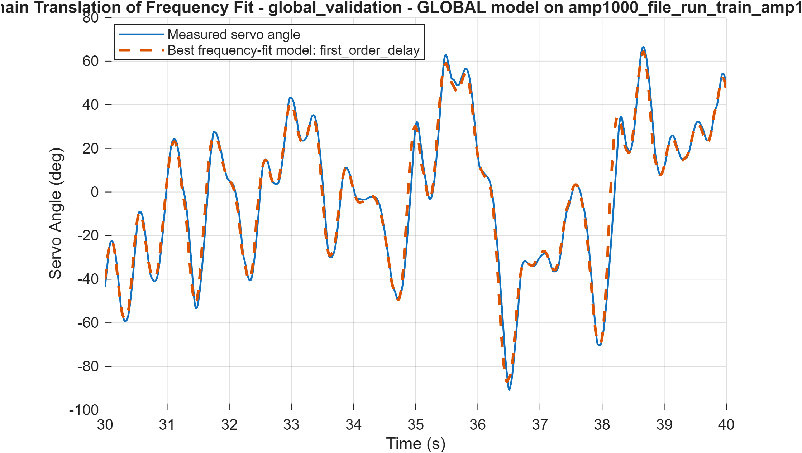

`lsim()` simulation of the global frequency-domain model against a held-out amp1000 validation time series. The model tracks the measured servo angle well across the full record, confirming that the frequency-domain fit translates to usable time-domain prediction.

### Conclusion

PRPS excitation over 0.15–3.05 Hz shows that the servo retains full command authority (≤0.3 dB magnitude variation) across the entire test band. Phase lag is the binding limitation: ~45° is reached near **2 Hz** and ~56° at **3 Hz**. The first-order-plus-delay model structure is confirmed across all tested amplitudes, and the identified DC gain (K ≈ 0.00156 rad/µs) is consistent with the [Section 3 — Static Command-to-Angle Map](#3-static-command-to-angle-map) static characterization to within 2%. Controller-design implications are discussed in [Section 9 — Controller-Design Implication](#9-controller-design-implication).

---

## 7. Candidate Model Fits

### Models Compared

Four candidate model structures were fitted to the pooled global FRF (all amplitudes, 84 frequency points):

| Model | Params | Train mag RMSE | Train phase RMSE | Notes |
|---|---:|---:|---:|---|
| First-order | 2 | 0.747 dB | 4.25° | Delay absent; large phase error |
| **First-order + delay** | **3** | **0.294 dB** | **2.71°** | **Selected** |
| Second-order lag | 3 | 0.433 dB | 2.85° | Equal-pole pair; no delay |
| Second-order lag + delay | 4 | 0.294 dB | 2.70° | Matches first-order + delay; unnecessary complexity |

A second-order model without delay was not competitive. Adding delay to the first-order model cut magnitude RMSE by 60% and phase RMSE by 36%. The second-order-lag-plus-delay model produced identical errors to `first_order_delay` (within rounding), so the simpler model is preferred per the parsimony criterion used by `selectBestFrequencyModel()` in [`analyze_servo_prps_frequency_fit.m`](../../analysis/system_identification/servo_identification/servo_prps_log/analyze_servo_prps_frequency_fit.m).

### Selected Model

The selected model is a **first-order lag with transport delay**, fit to the amplitude-pooled global FRF:

$$
G(s) = \frac{\theta(s)}{u_{cmd}(s)} = \frac{K}{1 + \tau s}\,e^{-Ls}
$$

### Model Parameters

| Parameter | Value | Units | Notes |
|---|---:|---|---|
| $K$ | 0.001556 | rad/µs | Steady-state gain; matches Section 3 static map within 2% |
| $\tau$ | 24.4 | ms | Dominant first-order time constant |
| $L$ | 28.8 | ms | Transport delay |
| Model BW (−3 dB) | 6.5 | Hz | From global fit; 4.7–10.7 Hz amplitude-dependent |

Substituting values:

$$
G(s) = \frac{0.001556}{1 + 0.0244\,s}\,e^{-0.0288\,s}
$$

### Conclusion

The selected model is **first-order plus delay** because adding a delay term is the single most impactful structural choice (phase RMSE drops 3× relative to first-order alone), while moving to a second-order structure adds no further accuracy. The model is simple enough for direct use in controller design and physically interpretable as a combined actuator lag and digital/mechanical transport delay.

---

## 8. Validation

Full validation detail — per-amplitude FRF error tables, model candidate comparisons, and time-domain simulation — is presented in [Section 6 — Targeted PRPS / Multi-Sine Results](#6-targeted-prps--multi-sine-results).

**Frequency-domain:** The global model scored against held-out seed-4005 files (one per amplitude, not used in fitting). Worst-case validation errors are 0.5 dB magnitude and 2.6° phase — acceptable for a first-order actuator model.

**Time-domain:** Simulated with `lsim()` against an independent amp1000 time series (3040-second record, seed 4005). The model tracks the measured servo angle with no systematic bias or drift across the full record.

The global first-order-plus-delay model validates well on held-out data and is suitable for rail-controller design.

---

## 9. Controller-Design Implication

### Main Question

Can the servo be treated as an instantaneous command-to-angle mapping, or should servo dynamics be included explicitly in the rail model?

### Analysis

The global model predicts the following phase lag at candidate controller bandwidths:

| Controller BW | Phase lag from τ | Phase lag from L | Total phase lag |
|---:|---:|---:|---:|
| 0.5 Hz | −4.3° | −5.2° | −9.5° |
| 1.0 Hz | −8.7° | −10.4° | −19.1° |
| 2.0 Hz | −17.2° | −20.8° | −38.0° |
| 3.0 Hz | −25.0° | −31.2° | −56.2° |

A rail controller targeting 1 Hz bandwidth would receive ~19° of uncompensated phase loss from the servo alone. For a controller with a 45° phase-margin target, this leaves only 26° of margin for rail plant uncertainty and other loop dynamics — which is tight. For 2 Hz or above, the servo phase contribution becomes the dominant stability constraint.

The servo delay L = 28.8 ms is particularly significant: unlike the first-order lag, delay cannot be compensated by simple loop-shaping and places a hard limit on achievable closed-loop bandwidth.

### Decision

- Static approximation acceptable? **No**
- Explicit actuator dynamics needed? **Yes**

The 53 ms combined lag (τ + L) is large enough to meaningfully constrain the rail-controller bandwidth and phase margin at any bandwidth above ~0.5 Hz. A static approximation would cause the controller to overestimate achievable bandwidth and produce designs with insufficient phase margin.

The servo should be modeled as an actuator state in the rail plant, either:

1. **Implicitly** — by designing the controller with the servo transfer function included in the open-loop model
2. **Explicitly** — by adding a servo state to the state-space rail model:

$$
\dot{\theta} = -\frac{1}{\tau}\theta + \frac{K}{\tau}\,u_{cmd}(t - L)
$$

### Final Recommendation

- **Recommended initial rail-controller bandwidth: ≤ 1 Hz**
- At 1 Hz the servo contributes ~19° phase lag, leaving adequate margin for rail plant dynamics
- If the target bandwidth must exceed 1 Hz, include the servo explicitly in the loop model and compensate for the delay
- Frequencies above 2 Hz should not be targeted for initial controller design; at 2 Hz the servo has already accumulated ~38° of phase lag

---

## 10. Final Result Summary

| Result | Value |
|---|---:|
| Usable command range | 450–2450 µs (≈ ±90°) |
| Neutral command | 1431 µs |
| Static gain | −0.00159 rad/µs (−55.9 dB) |
| Hysteresis | ~2 deg mean, ~4 deg max |
| Step-response τ (center-out) | ~47–50 ms |
| Step-response τ (cross-center reversal) | ~62 ms |
| PRPS gain K (global model) | 0.001556 rad/µs |
| PRPS time constant τ (global model) | 24.4 ms |
| PRPS delay L (global model) | 28.8 ms |
| Model-predicted −3 dB bandwidth | 6.5 Hz (global); 4.7–10.7 Hz (amplitude-dependent) |
| Phase lag at 1 Hz | ~19° |
| Phase lag at 2 Hz | ~38° |
| Practical usable bandwidth | ~2–3 Hz (phase-limited) |
| Selected model | First-order plus delay |
| Static approximation acceptable? | No |
| Explicit servo dynamics needed? | Yes |
| Recommended initial controller BW | ≤ 1 Hz |

## Final Conclusion

The servo actuator identification procedure produced a validated low-order actuator model suitable for initial rail-controller design. The servo behaves as a first-order lag with transport delay — consistent across all tested excitation amplitudes and confirmed by both frequency-domain PRPS fitting and time-domain simulation. The static gain agrees with the Section 3 command-to-angle map to within 2%, confirming internal consistency across all test methods.

The servo **cannot** be modeled as an instantaneous actuator for the rail controller. The 29 ms transport delay and 24 ms time constant together contribute approximately 19° of phase lag at a 1 Hz controller bandwidth, which is sufficient to significantly constrain achievable phase margin. For initial rail-controller design, a closed-loop bandwidth of ≤ 1 Hz is recommended, with the servo dynamics included explicitly in the open-loop model.