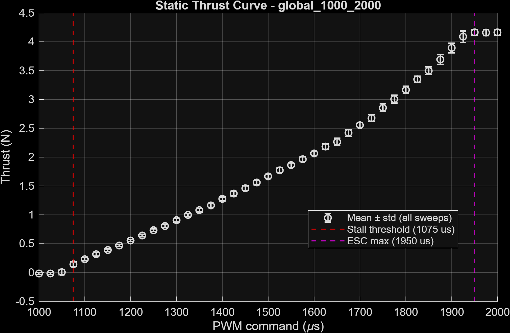
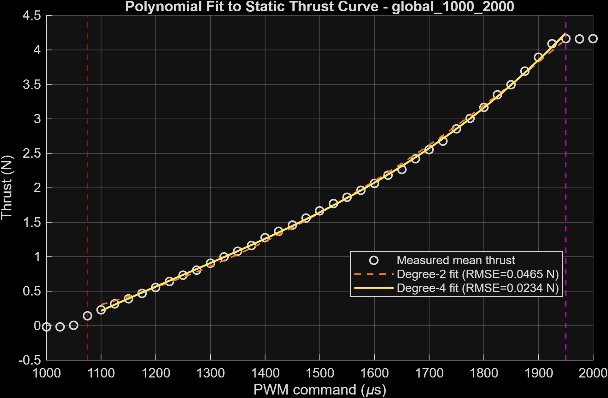
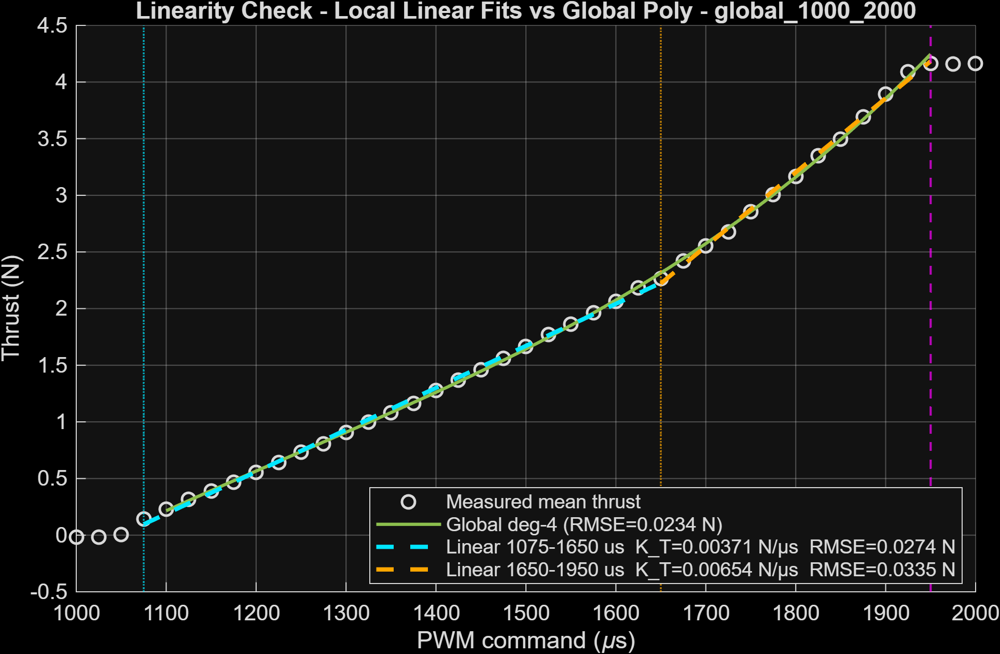
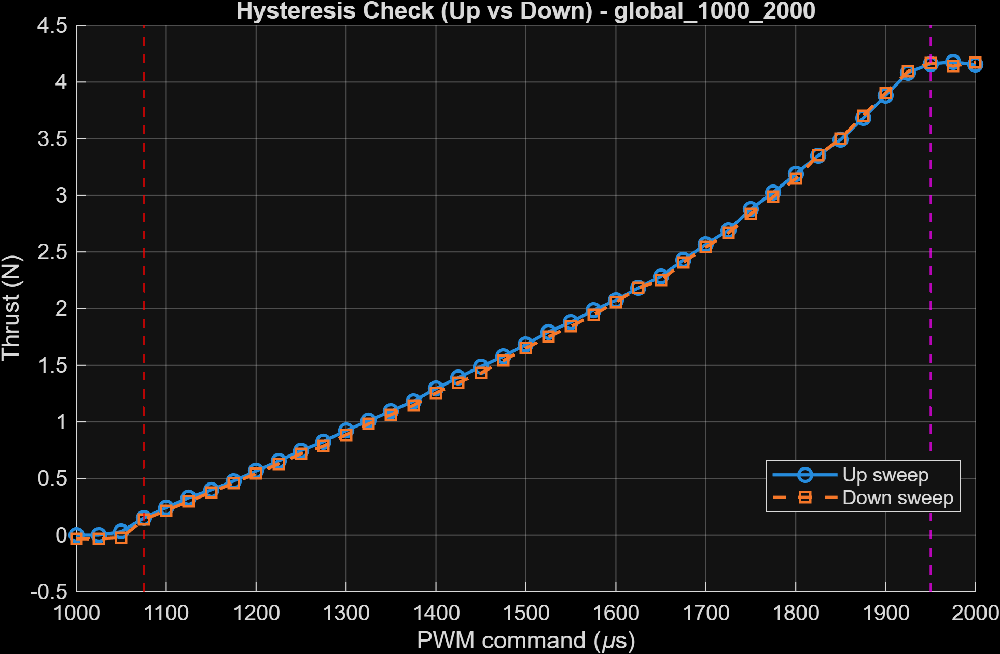
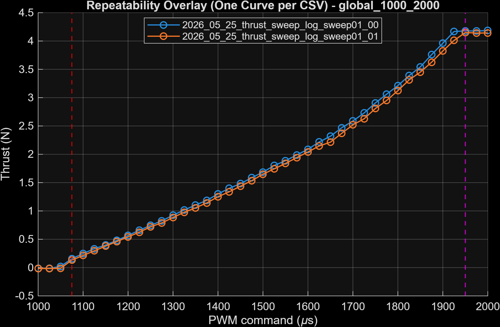
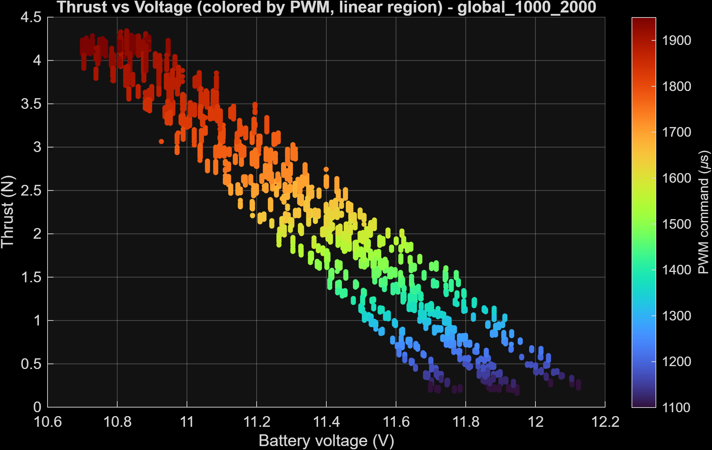
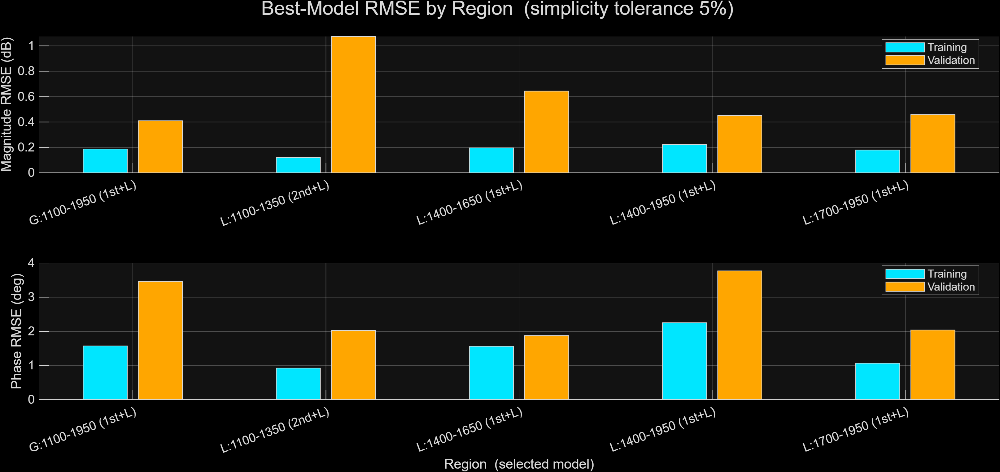
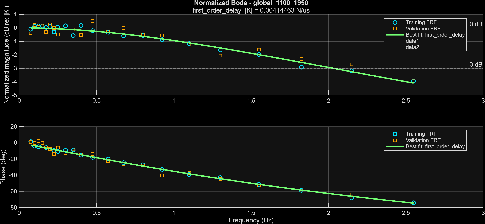
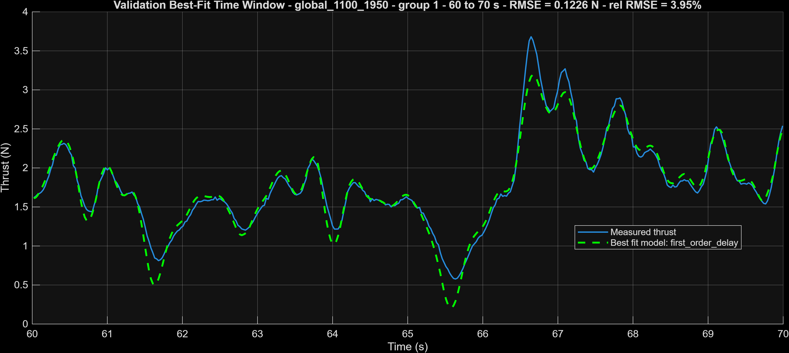

# Thrust Actuator Identification Results

## Summary

The thrust actuator is being characterized using a static PWM-to-thrust sweep and planned PRPS dynamic identification. The goal is to determine a low-order model mapping ESC command to thrust force suitable for initial rail-controller design.

**Current status: static sweep and PRPS dynamic identification complete.**

**Final model for initial controller design and friction testing:**

$$\boxed{G_{thrust}(s) = \frac{0.00414}{\,0.0781\,s + 1\,} \cdot e^{-0.0252 s} \quad \left[\frac{\text{N}}{\mu\text{s}}\right]}$$

| Parameter | Value |
|---|---:|
| $K$ | 0.00414 N/µs |
| $\tau_1$ | 78.1 ms |
| $L$ (delay) | 25.2 ms |
| Dominant bandwidth | 2.04 Hz (12.8 rad/s) |

This is the **global first-order-plus-delay** fit over the full usable operating range (1100–1950 µs). It is used as the thrust plant model for: (1) initial rail-controller PID design, and (2) friction identification experiments (where thrust is an input and friction force is the target output). See [Section 4 — Candidate Model Fits](#4-candidate-model-fits) and [Section 5 — Controller-Design Implications](#5-controller-design-implications) for identification details and controller-design implications.

**Identified static thrust map — degree-4 polynomial (fit range 1100–1950 µs):**

Let $\hat{u} = (u - 1525.0) / 256.2$ be the centered-and-scaled PWM command (µs). The static steady-state thrust is:

$$\boxed{F_{ss}(\hat{u}) = 1.828\times10^{-5}\,\hat{u}^4 + 0.053686\,\hat{u}^3 + 0.17600\,\hat{u}^2 + 1.06699\,\hat{u} + 1.74620 \quad [\text{N}]}$$

| Parameter | Value |
|---|---:|
| Normalization mean | 1525.0 µs |
| Normalization std | 256.2 µs |
| RMSE | 0.0234 N |
| MAE | 0.0169 N |
| Usable range | 1075–1950 µs → 0.23–4.17 N |

Evaluate with `polyval([p4 p3 p2 p1 p0], (u_us - 1525.0) / 256.2)`. See [Section 2 — Static Thrust Map](#2-static-thrust-map) for polynomial model selection rationale and the degree-2 alternative.

Initial conclusions from the static sweep:

> The thrust actuator is **nonlinear** across its full command range, as expected for a brushless motor + propeller system. The effective usable range is approximately **1075–1950 µs**: below 1075 µs the motor produces no measurable thrust, and above 1950 µs the thrust output saturates. A visual inspection suggests the 1075–1650 µs sub-range may be approximately linear, which would enable a simpler linearized controller model or a constrained operating region — but this has not yet been formally validated. The degree-4 polynomial captures the global static map significantly better than degree-2. Hysteresis is small and likely negligible for control purposes. Voltage-dependence is present but cannot be fully characterized from this sweep alone; PRPS tests at multiple battery states will provide a cleaner voltage-sensitivity estimate.

---

## 1. Test Setup

### Hardware

- Motor and propeller mounted on thrust testbed rail
- ESC driven from Raspberry Pi Pico PWM output (GP13/GP14)
- HX711 load cell amplifier with attached load cell (GP20 DAT, GP21 SCK)
- Pixhawk TELEM2 MAVLink connected to Pico UART0 (GP0 TX, GP1 RX) for battery voltage/current telemetry
- LiPo battery (voltage range observed: 10.70–12.21 V across sweep)
- Data logging rate: 50 Hz (20 ms sample interval)

### Relevant Files

| Item | Path |
|---|---|
| Raw data (candidate) | [`data/raw/system_identification/thrust_identification/thrust_sweep_log/candidate/`](../../data/raw/system_identification/thrust_identification/thrust_sweep_log/candidate) |
| Analysis script | [`analysis/system_identification/thrust_identification/thrust_sweep_log/analyze_thrust_sweep.m`](../../analysis/system_identification/thrust_identification/thrust_sweep_log/analyze_thrust_sweep.m) |
| Plots | [`plots/system_identification/thrust_identification/thrust_sweep_log/`](../../plots/system_identification/thrust_identification/thrust_sweep_log) |
| Procedure | [`experiments/thrust_identification/procedure.md`](procedure.md) |

---

## 2. Static Thrust Map

### Goal

Identify the steady-state mapping from ESC PWM command to measured thrust force:

$$
F_{ss} = f(u_{PWM})
$$

This characterizes:
- the motor arming threshold (minimum command producing measurable thrust)
- the full usable PWM range before saturation
- the nonlinear shape of the static map
- any dead zones, hysteresis, or asymmetry between up and down sweeps

### Data

Two CSV files were collected (global sweep, 1000–2000 µs, 25 µs step):

| File | Notes |
|---|---|
| `2026_05_25_thrust_sweep_log_sweep01_00.csv` | First sweep pass |
| `2026_05_25_thrust_sweep_log_sweep01_01.csv` | Second sweep pass (repeatability check) |

PWM range tested: 1000–2000 µs  
Force range observed: −0.116 to 4.364 N  
Battery voltage range: 10.70–12.21 V (sag visible at high command levels)

### Saturation Limits

The sweep reveals two clear saturation boundaries:

**Lower saturation — motor arm threshold: ~1075 µs**

Below approximately 1075 µs, the motor produces no measurable net thrust. The mean force at 1000 µs is −0.016 N and at 1050 µs is 0.004 N — both indistinguishable from zero given the tare uncertainty discussed below. At 1075 µs, mean force rises to 0.144 N with standard deviation 0.038 N, marking the onset of consistent thrust production. Commands below 1075 µs should be treated as a dead zone for control purposes.

**Upper saturation — thrust plateau: ~1950 µs**

Above approximately 1950 µs, thrust stops increasing with command. The mean force at 1950 µs is 4.165 N; at 1975 µs it drops slightly to 4.159 N and at 2000 µs is 4.163 N — all within one standard deviation of each other (~0.05 N). This saturation is consistent with propeller-limited thrust at maximum motor speed.

**Effective usable range: 1075–1950 µs**

### Tare Offset and Zero-Force Uncertainty

The motor-off setpoints (1000 and 1025 µs) show mean force readings of −0.016 N and −0.015 N respectively, with per-setpoint standard deviations of ~0.016 N. These negative values are **not physical** — the motor produces no thrust below the arm threshold. They are an artifact of insufficient load cell averaging before taring: a short tare window captures a noisy instantaneous count rather than a stable mean, leaving a small residual offset in all subsequent readings.

| Source | Value |
|---|---:|
| Estimated tare bias | ~−0.015 N |
| 1σ noise at motor-off | ~0.016 N |
| Zero-force uncertainty (2σ) | ~±0.032 N |

The practical implication is that any reported force below approximately **±0.03 N should be treated as indistinguishable from zero**. This affects only the dead-zone characterization at the low end of the sweep; it does not materially affect the polynomial fits or the operating-point selection at higher commands, where signal levels are 10–100× larger than this uncertainty.

For future PRPS tests, the pre-run tare baseline will be averaged over a longer window to reduce the residual offset. Additionally, the static sweep here is intended for initial controller design, not a precision force calibration — the PRPS frequency-domain tests will produce a more reliable dynamic gain estimate by identifying the input-output relationship across many excitation cycles rather than relying on individual steady-state force readings.

### Nonlinear Regime

The static map from 1075–1950 µs is clearly **nonlinear**, as expected for a brushless motor + propeller system where thrust scales approximately with the square of motor speed. The curvature is most visible at the low end (1075–1300 µs) and at the top of the range approaching saturation (1850–1950 µs). The middle portion of the range appears more linear by visual inspection.

### Linearity Check

A degree-1 fit was computed over each sub-range and compared against the global degree-4 fit evaluated over the same points. This tests whether each sub-range is well-described by a simple linear model, or whether the global nonlinear curve is needed.

| Range (µs) | $K_T$ (N/µs) | Linear RMSE (N) | Deg-4 RMSE same range (N) | Linear / Deg-4 ratio |
|---|---:|---:|---:|---:|
| 1075–1650 | 0.00371 | 0.0274 | 0.0159 | 1.73× |
| 1650–1950 | 0.00654 | 0.0335 | 0.0348 | 0.96× |

**1075–1650 µs (lower sub-range):** The local linear fit has RMSE 0.027 N — 1.7× worse than the global deg-4 over the same range (0.016 N). However, 0.027 N is already at the level of the tare uncertainty floor (~0.032 N 2σ, see Section on Tare Offset). The residual is therefore dominated by measurement noise rather than true nonlinearity. **If vehicle mass allows constraining thrust to this range (~0.23–2.27 N), a single linear gain $K_T = 0.00371$ N/µs is a valid model for initial controller design.** The extra complexity of the degree-4 polynomial would not produce a meaningfully better controller over the constrained range.

**1650–1950 µs (upper sub-range):** The local linear fit RMSE (0.034 N) essentially matches the global deg-4 RMSE over the same range (0.035 N) — a ratio of 0.96. The upper sub-range is individually near-linear. However, its slope ($K_T = 0.00654$ N/µs) is **76% larger** than the lower sub-range gain. This gain change is the dominant nonlinearity of the full static map: both halves are approximately linear in isolation, but with substantially different slopes.

**Implication for controller design:** The two-region structure points directly toward a two-regime gain schedule if the full 0.23–4.17 N range is needed. The minimum complexity model for the full range is two piecewise-linear segments with a transition at approximately 1650 µs. A single global linear fit across the full range would introduce significant gain error in at least one regime.

### Polynomial Model Fits

Two polynomial models were fit to the static map over the usable range (1100–1950 µs):

#### Degree-2 Polynomial

Both polynomials are fit using MATLAB's centered-and-scaled `polyfit` form. Let $\hat{u} = (u - 1525.0) / 256.2$ denote the normalized PWM command (mean 1525.0 µs, std 256.2 µs over the fit range). The coefficients below are in normalized coordinates; `polyval` with the stored `mu` vector evaluates them correctly at raw µs values.

$$
F_{ss} = 0.17604\,\hat{u}^2 + 1.16076\,\hat{u} + 1.74619
$$

| Metric | Value |
|---|---:|
| RMSE | 0.0465 N |
| MAE | 0.0396 N |

#### Degree-4 Polynomial

$$
F_{ss} = 1.828 \times 10^{-5}\,\hat{u}^4 + 0.053686\,\hat{u}^3 + 0.17600\,\hat{u}^2 + 1.06699\,\hat{u} + 1.74620
$$

| Metric | Value |
|---|---:|
| RMSE | 0.0234 N |
| MAE | 0.0169 N |

The degree-4 polynomial reduces RMSE by ~50% relative to degree-2 (0.023 N vs. 0.047 N). It better captures the curvature near the saturation regions at both ends of the usable range. The additional two parameters are justified by the clear nonlinearity of the static map.

**For control design, the degree-4 polynomial is preferred as the global static map.** However, for local linearization around a chosen operating point, both models converge to the same local slope $K_T = dF/du|_{u_0}$, which is what matters for pole placement.

### Hysteresis

| Metric | Value |
|---|---:|
| Mean \|up − down\| | 0.0286 N |
| Max \|up − down\| | 0.0579 N |

Measured hysteresis is small relative to the total thrust range (0.23–4.16 N). The mean difference of 0.029 N corresponds to less than 1% of the full usable range.

This level of hysteresis should be interpreted cautiously: the down-sweep in this test follows the up-sweep without a long hold at each setpoint. Motor thermal state and propeller wash effects mean the down-sweep was conducted with the motor in a warming condition rather than at true thermal equilibrium. A slower ramp-down with longer holds at each setpoint would produce a more conservative hysteresis estimate. For the purposes of initial controller design, the observed hysteresis is **likely negligible**, but this conclusion should be revisited if steady-state thrust errors are observed in closed-loop testing.

### Voltage Dependence

Battery voltage varied from 12.21 V at low command levels to 10.70 V under high-thrust load — a drop of approximately 1.5 V across the sweep. Motor thrust depends on voltage: at a fixed PWM command, thrust decreases as voltage sags. This introduces a slowly-varying bias in the static map, most visible at high command levels where current draw is large.

The sweeps in this test were not collected at significantly different battery charge states (the battery was at approximately the same initial state of charge for both runs), so voltage-dependent variation in the static map cannot be fully characterized from this data alone. A dedicated voltage-sensitivity test, or inspection of per-run voltage trends in the PRPS data, will be needed to quantify this effect explicitly.

Voltage dependence will be more directly observable in the PRPS dynamic identification runs, where battery voltage is logged at every sample and can be used to detect or correct for slow voltage drift within individual acquisition sets.

### Plots

**Static Thrust Curve**

Mean thrust vs. PWM command across the full 1000–2000 µs range. The dead zone below 1075 µs, the usable thrust-producing region, and the saturation plateau above 1950 µs are all visible. Error bars show ±1 standard deviation across samples at each setpoint.

**Polynomial Fit to Static Thrust Curve**

Degree-2 and degree-4 polynomial fits overlaid on the empirical setpoint means over the 1100–1950 µs fit range. The degree-4 model more closely tracks the curvature near the saturation boundaries.

**Linearity Check — Local Linear Fits vs. Global Polynomial**

Local degree-1 fits over 1075–1650 µs (cyan dashed) and 1650–1950 µs (orange dashed), with the global degree-4 fit shown as a de-emphasised reference. Each linear segment is drawn only over its own sub-range. The break in slope at 1650 µs is clearly visible — the two linear fits diverge significantly from each other, reflecting the 76% gain difference between sub-ranges.

**Hysteresis Check (Up vs. Down Sweep)**

Up-sweep and down-sweep mean thrust at each setpoint, with the signed difference shown. Differences are small and unsystematic, consistent with negligible steady-state hysteresis.

**Repeatability Overlay (One Curve per CSV)**

Both CSV files plotted on the same axes. The curves overlap closely across the usable range, confirming good test-to-test repeatability. Note that battery voltage is expected to drop between runs as the pack discharges, and lower voltage at a fixed PWM command should produce slightly lower thrust — a small downward shift in the second run is an expected physical effect, not measurement noise. A hint of this is visible in the plot at higher command levels. Voltage-dependent gain will be characterized more explicitly in PRPS identification.

**Thrust vs. Voltage (Colored by PWM, Linear Region)**

Thrust plotted against battery voltage, with points colored by PWM command level. Voltage sag is most pronounced at higher command levels. This plot shows the correlated structure of voltage and thrust across the sweep, which motivates careful voltage monitoring during PRPS identification.

### Conclusion

The static sweep establishes the effective usable PWM range as **1075–1950 µs**, producing steady-state thrust from approximately **0.23 N to 4.17 N**. The static map is nonlinear across this full range — a degree-4 polynomial is the preferred global model (RMSE 0.023 N vs. 0.047 N for degree-2).

The linearity check reveals that the dominant nonlinearity is a **gain change between two approximately-linear regimes**, not curvature within each regime. Both the 1075–1650 µs and 1650–1950 µs sub-ranges are individually near-linear, but their local gains differ by 76% ($K_T$ = 0.00371 vs. 0.00654 N/µs). If vehicle mass affords constraining operation to the lower sub-range, the linear model with $K_T = 0.00371$ N/µs is a valid candidate for initial controller design: its RMSE (0.027 N) is at the measurement uncertainty floor. If the full thrust range is required, a two-segment piecewise-linear gain schedule is the minimum-complexity extension.

Hysteresis is small (~0.03 N mean) and likely negligible for initial control design. Voltage-dependence is present and will be characterized more explicitly in PRPS dynamic identification.

**Operating-point selection for PRPS identification should target the lower linear sub-range (1075–1650 µs).** A center command near ~1350–1400 µs (midrange of that sub-range, producing ~1.0–1.3 N) is a reasonable starting point. The exact operating point should be confirmed after measuring vehicle mass and desired thrust.

---

## 3. PRPS Dynamic Identification

### Goal

Estimate the dynamic relationship from ESC PWM command to measured thrust across the full operating range:

$$G_{thrust}(s) = \frac{\Delta F(s)}{\Delta u_{PWM}(s)} \quad \left[\frac{\text{N}}{\mu\text{s}}\right]$$

PRPS (pseudo-random periodic signal) excitation was used: a periodic multisine with randomized phases that simultaneously injects energy across many frequencies, enabling efficient frequency-response function (FRF) estimation via averaged DFT.

### Hardware Note: Load Cell Issues

Following the static sweep, a load cell hardware issue emerged — suspected noisy electrical connections. This precluded dedicated PRPS testing focused on the **1075–1650 µs linear sub-range** that had been identified in the static sweep as the most promising operating region for a simple linearized controller. Analysis is therefore limited to data collected prior to the onset of these issues. Future re-testing of the linear sub-range is recommended once the hardware connection is confirmed.

### Data and Accepted Files

PRPS data was collected and accepted across a global operating range and four local operating regions. The split used accepted files organized into explicit `train/` and `validation/` folders.

| Run name | PWM range (µs) | Training files | Validation files |
|---|---:|---:|---:|
| global\_1100\_1950 | 1100–1950 | 4 | 1 |
| local\_1100\_1350 | 1100–1350 | 4 | 1 |
| local\_1400\_1650 | 1400–1650 | 2 | 1 |
| local\_1400\_1950 | 1400–1950 | 3 | 1 |
| local\_1700\_1950 | 1700–1950 | 2 | 1 |

**Relevant files:**

| Item | Path |
|---|---|
| Raw data (accepted) | [`data/raw/system_identification/thrust_identification/thrust_prps_daq_voltage/accepted/`](../../data/raw/system_identification/thrust_identification/thrust_prps_daq_voltage/accepted) |
| Analysis script | [`analysis/system_identification/thrust_identification/thrust_prps_daq_voltage/analyze_thrust_prps_frequency_fit.m`](../../analysis/system_identification/thrust_identification/thrust_prps_daq_voltage/analyze_thrust_prps_frequency_fit.m) |
| Plots | [`plots/system_identification/thrust_identification/thrust_prps_daq_voltage/`](../../plots/system_identification/thrust_identification/thrust_prps_daq_voltage) |

### Sampling Conditions

All runs showed a median sample period of **23 ms** (≈43 Hz) with mean rates of 39–40 Hz due to occasional scheduling jitter. Nominal sample period was used for FRF computation to avoid jitter-induced bias. PRPS excitation covered **0.075–2.55 Hz** (22 frequency points per run). Median coherence across all runs was ≥ 0.996, indicating clean input-output relationships.

---

## 4. Candidate Model Fits

### Candidate Structures

Four continuous-time model structures were evaluated for each operating region, selected by the `simplicity_tolerance` criterion: the simplest model whose training weighted FRF error is within 5% of the best-fit model is preferred.

| Structure | Equation |
|---|---|
| first\_order | $G(s) = K / (\tau_1 s + 1)$ |
| first\_order\_delay | $G(s) = [K / (\tau_1 s + 1)] \cdot e^{-Ls}$ |
| second\_order\_lag | $G(s) = K / [(\tau_1 s + 1)(\tau_2 s + 1)]$ |
| second\_order\_lag\_delay | $G(s) = [K / ((\tau_1 s + 1)(\tau_2 s + 1))] \cdot e^{-Ls}$ |

### Model Comparison Across Regions

The table below lists the best-selected model for each operating region. The comprehensive bar chart (figure 11) visually compares training and validation errors across all candidates.

| Run | Model type | $K$ (N/µs) | $\tau_1$ (s) | $\tau_2$ (s) | $L$ (s) | Train mag RMSE | Val mag RMSE |
|---|---|---:|---:|---:|---:|---:|---:|
| global\_1100\_1950 | first\_order\_delay | 0.00414 | 0.0781 | — | 0.0252 | 0.187 dB | 0.410 dB |
| local\_1100\_1350 | second\_order\_lag\_delay | 0.00338 | 0.1483 | 0.020 | 0.00979 | 0.122 dB | 1.074 dB |
| local\_1400\_1650 | first\_order\_delay | 0.00405 | 0.0780 | — | 0.0291 | 0.196 dB | 0.643 dB |
| local\_1400\_1950 | first\_order\_delay | 0.00503 | 0.0580 | — | 0.0264 | 0.223 dB | 0.450 dB |
| local\_1700\_1950 | first\_order\_delay | 0.00647 | 0.0420 | — | 0.0272 | 0.179 dB | 0.458 dB |

**Model comparison — training vs. validation error, all candidate structures by region:**

Key observations from the cross-region comparison:

- **Delay is nearly constant across all regions.** For the `first_order_delay` fits, the identified delay $L$ ranges from 0.025 to 0.029 s (spread ≈ 15% of mean). This consistency strongly suggests the delay is a hardware/firmware latency rather than an operating-point-dependent effect. It is incorporated explicitly in the model.

- **K increases monotonically with operating point.** Gain rises from ≈ 0.0034 N/µs at the lowest local region (1100–1350 µs) to ≈ 0.0065 N/µs at the highest (1700–1950 µs) — a 91% increase — consistent with the nonlinear static map. This confirms the two-regime gain structure identified in the static sweep.

- **$\tau_1$ decreases with operating point.** The dominant time constant shrinks from ≈ 148 ms at low thrust to ≈ 42 ms at high thrust, indicating faster thrust dynamics at higher operating points.

- **The global model generalizes well.** Despite spanning the full nonlinear operating range, the global `first_order_delay` achieves a validation magnitude RMSE of 0.41 dB — comparable to the local models evaluated over their narrower sub-ranges. The training-to-validation gap is small and consistent, indicating no overfitting.

### Selected Model: global\_1100\_1950

The **global\_1100\_1950 first-order-plus-delay** model is selected for initial controller design.

$$\boxed{G_{thrust}(s) = \frac{K}{\tau_1 s + 1} \cdot e^{-Ls}}$$

| Parameter | Value |
|---|---:|
| $K$ | 0.00414 N/µs |
| $\tau_1$ | 78.1 ms |
| $L$ (delay) | 25.2 ms |
| Dominant bandwidth | 2.04 Hz (12.8 rad/s) |

**Rationale:** The global model covers the full intended operating range (1100–1950 µs). Its training and validation errors are low and balanced, with no significant gap. Dedicated local linear region (1075–1650 µs) tests were not completed due to load cell hardware issues, so no single local model is available that covers the planned operating regime. The global model is the best available aggregate description of the thrust dynamic envelope and is appropriate for initial PID controller design.

The simpler `first_order_delay` is preferred over the `second_order_lag_delay` for the global region: both have essentially identical training weighted errors (0.0351 vs 0.0352), and the three-parameter model is selected under the 5% simplicity tolerance criterion.

### Normalized Bode Plot — Global Model

The normalized Bode overlays training and validation FRF data against the fitted model, with magnitude normalized by the identified gain $|K|$ (so the DC value reads 0 dB). Training data is shown in cyan; validation in orange; the fitted model in lime.

The model captures the measured frequency response well across the full excitation band (0.075–2.55 Hz). The magnitude rolloff and phase accumulation are consistent with a first-order lag combined with pure delay, and the model curves follow both training and validation data closely with no visible systematic bias. Frequency density was not a priority in the PRPS design: a low-order model was expected from prior knowledge of the system (propeller-motor inertia), and 22 frequency points provide sufficient resolution to resolve the single-pole rolloff and the delay-induced phase slope.

### Time-Domain Validation — Global Model

The time-domain validation applies the identified frequency-domain model via `lsim` to the validation file input, then compares the predicted thrust output to the measured signal over a representative 10-second window (60–70 s).

The model tracks the dynamic response well through the mid-range of the PRPS excitation. Window RMSE is **0.123 N** (relative RMSE ≈ 3.95%), consistent with the frequency-domain validation error.

The visible overshoot and undershoot at extreme PWM command values is expected: the PRPS excitation dips near the lower boundary (~1100 µs) and approaches the upper saturation (~1950 µs), where the linearized gain assumption in the frequency-domain model breaks down due to the nonlinear static map documented in Section 2. This mismatch is localized to the range boundaries and does not materially degrade model quality at the intended steady-state operating point. It is acceptable for initial controller design.

---

## 5. Controller-Design Implications

The identified model:

$$G_{thrust}(s) = \frac{0.00414}{\,0.0781\,s + 1\,} \cdot e^{-0.0252 s} \quad \left[\frac{\text{N}}{\mu\text{s}}\right]$$

has a dominant bandwidth of **2.04 Hz** (12.8 rad/s) and a delay of **25.2 ms**. The delay imposes a gain-margin constraint on any closed-loop controller wrapping this plant.

For the rail controller, thrust is an inner actuator — the outer loop closes over rail position or velocity, not thrust directly. Whether the thrust dynamics appear explicitly in the plant depends on the target rail-controller bandwidth:

- If the outer loop bandwidth is ≪ 2 Hz (e.g., ≤ 0.3 Hz), the thrust lag at 78 ms is fast relative to the loop and the static approximation $G_{thrust}(s) \approx K$ with the delay treated as a gain-margin margin is appropriate.
- If the outer loop bandwidth approaches 1–2 Hz, the thrust lag should be retained in the plant model.

Given the servo bandwidth (≈ 1 Hz dominant, 0.1 Hz initial controller target from servo results), a **rail controller bandwidth of 0.1–0.3 Hz** is the current target. At those frequencies, the 78 ms thrust lag contributes less than 3° phase lag, and the static approximation is valid. The 25 ms delay contributes ≈ 1–3° at these frequencies — also small but should be retained as a stability margin constraint.

**Recommendation for initial PID design:** treat the thrust actuator as a static gain $K_{thrust} = 0.00414$ N/µs with a 25 ms pure delay. Account for the delay in phase-margin calculations when sizing the rail controller bandwidth.

---

## Current Status

| Step | Status |
|---|---|
| Load cell calibration verification | Not yet formally documented |
| Static thrust map | **Complete** — see Section 2 |
| Operating point selection for PRPS | Selected global 1100–1950 µs range |
| PRPS dynamic identification | **Complete** — see Sections 3–4 |
| Model candidate comparison | **Complete** — see Section 4 |
| Final model selection | **Complete** — first\_order\_delay, global\_1100\_1950 |
| Dedicated linear sub-range (1075–1650 µs) testing | Deferred — load cell hardware issues |
| Controller-design implications | **Complete** — see Section 5 |
